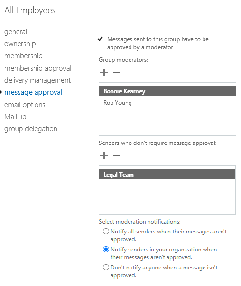

# Configure moderated recipients in Exchange Online

In your Exchange Online organization, messages that are sent to moderated recipients require the approval of a moderator before they're actually delivered. For more information, see [Moderated recipients in Exchange Online](moderated-recipients-exo.md).

This article described how to configure moderated groups in the Exchange admin center (EAC) and all recipient types in Exchange Online Powershell.

## What do you need to know before you begin?

- Estimated time to complete: 5 minutes

- For more granular control over messages that need approval, you can use mail flow rules (transport rules). For details, see [Use mail flow rules for message approval scenarios in Exchange Online](../../security-and-compliance/mail-flow-rules/common-message-approval-scenarios.md).

- The moderation parameters are available to modify the following types of recipients using the corresponding cmdlets:
  - [Set-DistributionGroup](/powershell/module/exchange/set-distributiongroup)
  - [Set-DynamicDistributionGroup](/powershell/module/exchange/set-dynamicdistributiongroup)
  - [Set-Mailbox](/powershell/module/exchange/set-mailbox)
  - [Set-MailContact](/powershell/module/exchange/set-mailcontact)
  - [Set-MailPublicFolder](/powershell/module/exchange/set-mailpublicfolder)
  - [Set-MailUser](/powershell/module/exchange/set-distributiongroup)
  - [Set-UnifiedGroup](/powershell/module/exchange/set-unifiedgroup)

- You need to be assigned permissions before you can perform this procedure or procedures. To see what permissions you need, see the"Moderated Transport" entry in the  [Feature permissions in Exchange Online](../../permissions-exo/feature-permissions.md) topic.

- You can use the EAC or PowerShell to configure groups for moderation. All other recipient types can only be configured for moderation using PowerShell. To open the EAC, see [Exchange admin center in Exchange Online](../../exchange-admin-center.md). To connect to Exchange Online PowerShell, see [Connect to Exchange Online PowerShell](/powershell/exchange/connect-to-exchange-online-powershell).

- For information about keyboard shortcuts that may apply to the procedures in this topic, see [Keyboard shortcuts for the Exchange admin center](../../accessibility/keyboard-shortcuts-in-admin-center.md).

> [!TIP]
> Having problems? Ask for help in the Exchange forums. Visit the forums at [Exchange Online](/answers/topics/office-exchange-server-itpro.html) or [Exchange Online Protection](https://social.technet.microsoft.com/forums/forefront/home?forum=FOPE).

## Use the EAC to configure a moderated distribution group

> [!NOTE]
> The folowing steps are basically the same for all group types: distribution groups, mail-enabled security groups, dynamic distribution groups, and Microsoft 365 Groups.

A common scenario for moderation is to control email replies to large groups. In fact, groups with more than 5,000 members automatically have moderation configured.

This example configures moderation for the distribution group named All Employees with the following settings:

- Assign Bonnie Kearney and Rob Young as moderators.
- Allow the members of the distribution group named Legal Team to bypass moderation.
- Notify internal senders if their message to the distribution group is rejected, but do not send any notifications to external senders.

To accomplish the tasks in this example scenario, perform the following procedure:

1. In the EAC, go to **Recipients** \> **Groups**.
2. In the result pane, select the **All employees** distribution group and click **Edit** .
3. On the properties page that opens, select the **Message approval** tab and configure the following settings:
   - Select the **Messages sent to this group have to be approved by a moderator** check box. You need to do this to make the remaining settings available.
   - In the **Group moderators** list, click **Add** .
   - In the **Select group moderators** dialog that opens, find and select Bonnie Kearney, click **Add**, find and select Rob Young, and click **Add**. When you're finished, click **OK**.
   - In the **Senders who don't require message approval** list, click **Add** .
   - In the **Select senders** dialog that opens, find and select Legal Team from the list and click **Add**. When you're finished, click **OK**.
   - In the **Select moderation notifications** section, select **Notify senders in your organization when their messages aren't approved**.
4. When you're finished, click **Save**.



## Use Exchange Online PowerShell to configure a moderated recipient

Run the following command:

```powershell
Set-<RecipientType> -Identity <Identity> -ModerationEnabled $true -ModeratedBy <recipient1,recipient2...> -ByPassModerationFromSendersOrMembers <recipient1,recipient2...> -SendModerationNotifications <Never | Always | Internal>
```

This example configures the following moderation settings for the distribution group named All Employees:

- Enable moderation for the distribution group.
- Designate David Hamilton and Yossi Ran as moderators.
- Allow the members of the distribution group named HR to bypass moderation.
- Notify internal senders if their message to the distribution group is rejected, but do not send any notifications to external senders.

To accomplish the tasks in this example scenario, run the following command:

```powershell
Set-DistributionGroup -Identity "All Employees" -ModerationEnabled $true -ModeratedBy "David Hamilton","Yossi Ran" -ByPassModerationFromSendersOrMembers HR -SendModerationNotifications Internal
```

To add or remove users from the list of moderators or recipients who bypass moderation without affecting other entries, use the following syntax:

```powershell
Set-<RecipientType> -Identity <Identity> -ModeratedBy @{Add="<recipient1>","<recipient2>"...; Remove="<recipient1>","<recipient2>"...} -ByPassModerationFromSendersOrMembers @{Add="<recipient1>","<recipient2>"...; Remove="<recipient1>","<recipient2>"...}
```

This example configures the following moderation settings for the distribution group named All Employees:

- Add the user chris@contoso.com to the list of existing moderators.
- Remove the user michelle@contoso.com from the list of existing senders who bypass moderation.

```PowerShell
Set-DistributionGroup -Identity "All Employees" -ModeratedBy @{Add="chris@contoso.com"} -ByPassModerationFromSendersOrMembers @{Remove="michelle@contoso.com"
```

## How do you know this worked?

To verify that you have successfully configured a recipient for moderation, do the following steps:

1. Send a test message to the moderated recipient.
2. Verify the designated moderators receive notification.
3. Verify the recipients who bypass moderation receive the message directly.
