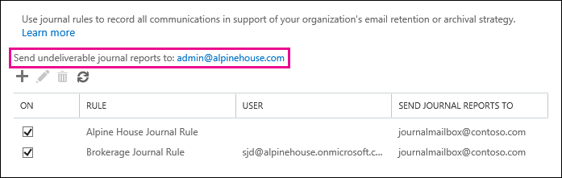

# Configure Journaling in Exchange Online

Journaling allows you to meet your organization's archiving requirements. You can create journal rules and have messages matching the rule's conditions delivered to the journaling address specified in the rule. For more information about journaling, see [Journaling in Exchange Online](journaling.md).

Here are two things you need to know before you start creating journal rules.

## Specify a journaling mailbox

A journaling mailbox is the mailbox or recipient that receives journal reports for messages that match a journal rule's conditions. You can specify different journaling mailboxes for different journal rules. For example, you can create a journal rule to journal messages sent or received by users in Europe and another one to journal messages sent or received by users in North America, and configures each rule to deliver journal reports to an address in their own geography. Or configure different journal rules for users in the Finance and Legal departments and similarly, have the journal reports delivered to different addresses.

Exchange Online doesn't support delivering journal reports to an Exchange Online mailbox. You must specify the email address of an on-premises archiving system or a third-party archiving service as the journaling mailbox.

> [!IMPORTANT]
> If you've configured a journaling rule to send the journal reports to a journaling mailbox that doesn't exist or is an invalid destination, the journal report remains in the transport queue on Microsoft datacenter servers; delivery of queued items is periodically retried. If this happens, Microsoft datacenter personnel will attempt to contact your organization and ask you to fix the problem so that the journal reports can be successfully delivered to a journaling mailbox. If you haven't resolved the issue after two days of being contacted, Microsoft will disable the problematic journaling rule.

## Specify an alternate journaling mailbox for undeliverable journal reports

As previously explained, undeliverable journal reports are queued on Microsoft datacenter servers. Undeliverable journal reports can't be returned to the sender in a non-delivery report (also known as an NDR or bounce message) because the sender is the Exchange Online service. To handle the NDRs for undelivered journal reports, you have to you specify an alternate journaling mailbox that accepts the NDRs for all undeliverable journal reports. Like the journaling mailbox, the alternate journaling mailbox can't be an Exchange Online mailbox.

The original journal report is an attachment in the NDR. When the journaling mailbox for a undelivered journal report becomes available again, you can use the **Resend this message** feature in Outlook on the NDRs in the alternate journaling mailbox to send the unaltered delivery report to the journaling mailbox.

