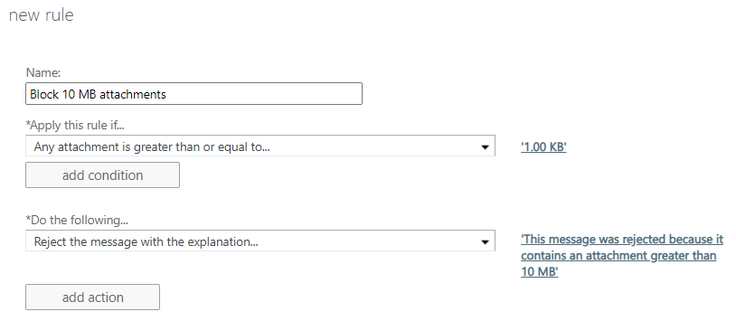

# Common attachment blocking scenarios for mail flow rules in Exchange Online

In Exchange Online organizations or standalone Exchange Online Protection (EOP) organizations without Exchange Online mailboxes, you might need to block or reject certain types of messages in order to meet legal or compliance requirements, or to meet specific business needs. This article discusses examples of common scenarios for blocking all attachments which you can set up using mail flow rules (also known mail flow rules) in Exchange Online.

For additional examples showing how to block specific attachments, see [Use mail flow rules to inspect message attachments in Exchange Online](inspect-message-attachments.md).

The malware filter includes a Common Attachment Types Filter. In the Exchange admin center (EAC), go to **Protection**, then click **New** ( ) to add filters. In the Exchange Online portal, browse to **Protection**, and then select **Malware Filter**.

To get started implementing any of these scenarios to block certain message types:

1. Open the Exchange admin center (EAC). For more information, see [Exchange admin center in Exchange Online](../../exchange-admin-center.md).

2. Go to **Mail flow** \> **Rules**.

3. Click **New** ( ) and then select **Create a new rule**.

4. In the **Name** box, specify a name for the rule, and then click **More options**.

5. Select the conditions and actions you want.

> [!NOTE]
> In the EAC, the smallest attachment size that you can enter is 1 kilobyte, which should detect most attachments. However, if you want to detect every possible attachment of any size, you need to use PowerShell to adjust the attachment size to 1 byte after you create the rule in the EAC. To connect to PowerShell, see [Connect to Exchange Online PowerShell](/powershell/exchange/connect-to-exchange-online-powershell) or [Connect to standalone Exchange Online Protection PowerShell](/powershell/exchange/connect-to-exchange-online-protection-powershell).
>
> Embedded images are treated as attachments (for example, messages with a picture in the signature). For this reason, we do not recommend using a very small value for the attachment size since unexpected messages will be blocked.

## Example 1: Block messages with attachments, and notify the sender

If you don't want certain people in your organization to send or receive attachments greater than 10 Megabytes, you can set up a mail flow rule to block messages with attachments of this size.

In this example, all messages sent to or from the organization with attachments greater than 10 Megabytes are blocked.

If all you want to do is block the message, you might want to stop rule processing once this rule is matched. Scroll down the rule dialog box, and select the **Stop processing more rules** check box.

## Example 2: Notify intended recipients when an inbound message is blocked

If you want to reject a message but let the intended recipient know what happened, you can use the **Notify the recipient with a message** action.

You can include placeholders in the notification message so that it includes information about the original message. The placeholders must be enclosed in two percent signs (%%), and when the notification message is sent, the placeholders are replaced with information from the original message. You can also use basic HTML such as \<br\>, \<b\>, \<i\>, and \ in the message.

 

****

|Type of information|Placeholder|
|---|---|
|Sender of the message.|%%From%%|
|Recipients listed on the "To" line.|%%To%%|
|Recipients listed on the "Cc" line.|%%Cc%%|
|Subject of the original message.|%%Subject%%|
|Headers from the original message. This is similar to the list of headers in a delivery status notification (DSN) generated for the original message.|%%Headers%%|
|Date the original message was sent.|%%MessageDate%%|
|

In this example, all messages that contain attachments and are sent to people inside your organization are blocked, and the recipient is notified.

## Example 3: Modify the subject line for notifications

When a notification is sent to the recipient, the subject line is the subject of the original message. If you want to modify the subject so that it is clearer to the recipient, you must use two mail flow rules:

- The first rule adds the word "undeliverable" to the beginning of the subject of any messages with attachments.

- The second rule blocks the message and sends a notification message to the sender using the new subject of the original message.

> [!IMPORTANT]
> The two rules must have identical conditions. Rules are processed in order, so the first rule adds the word "undeliverable", and the second rule blocks the message and notifies the recipient.

Here's what the first rule would look like if you want to add "undeliverable" to the subject:

And the second rule does the blocking and notification (the same rule from Example 2):

## Example 4: Apply a rule with a time limit

If you have a malware outbreak, you might want to apply a rule with a time limit so that you temporarily block attachments. For example, the following rule has both a start and stop day and time:

## See also

[Mail flow rules (transport rules) in Exchange Online](mail-flow-rules.md)

[Mail flow rules (Exchange Online Protection)](/microsoft-365/security/office-365-security/mail-flow-rules-transport-rules-0)
