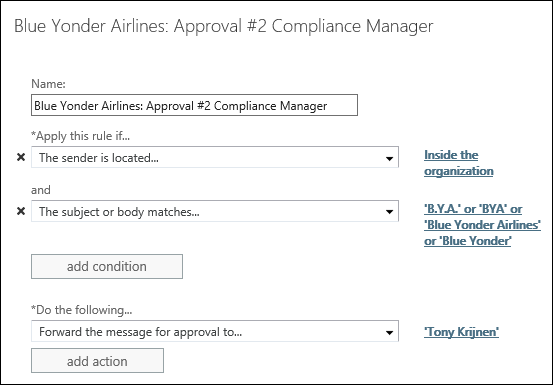

# Use mail flow rules for message approval scenarios in Exchange Online

> [!NOTE]
> This article does not apply to standalone Exchange Online Protection (EOP) organizations.

In Exchange Online organizations, a moderated recipient requires the approval one or more moderators before messages are delivered to the recipient. For more information see [Moderated recipients in Exchange Online](../../recipients-in-exchange-online/moderated-recipients-exo/moderated-recipients-exo.md).

But, other than exceptions from specific senders, when you configure the moderation settings in the properties of the recipient, **all** messages that are sent to the recipient require approval before they're delivered, regardless of the content or specifics of the messages.

For granular control over the type and circumstances of messages that require moderation, you can use mail flow rules (also known as transport rules). This article discusses examples of using mail flow rules for moderation in order to meet specific legal, compliance, or business requirements.

## Forward messages to a sender's manager for approval

Here are some common types of messages that might require manager approval:

- Messages sent from a user to certain distribution groups or recipients
- Messages sent to external users or partners
- Message sent between two groups
- Messages sent with specific content, such as the name of a specific customer
- Messages sent by a trainee

To require that messages need to be sent to the sender's manager for approval, follow these steps:

1. Create a mail flow rule using the **Send messages to a moderator** template.

   

2. Configure the action to send messages to the sender's manager for approval: **Do the following** \> **Forward to the sender's manager for approval**.

3. Configure the conditions that define the messages that require approval in **Apply this rule if**.

Here's an example where all external messages sent by the trainee named Garth Fort require approval by their manager.

- **Apply this rule if** \> **The sender is** \> **Garth Fort**

  and

- **Apply this rule if** \> **The recipient is located** \> **Outside the organization**
- **Do the following** \> **Forward to the sender's manager for approval**

> [!NOTE]
> Some rule settings, including the ability to add multiple conditions or exceptions to the rule as in this example, are hidden by default. To see them, click **More options**.

## Set up a message approval chain

You can require multiple levels of approval for messages. For example, you can require that messages to a specific customer be approved first by a customer relationship manager and then by a compliance officer, or you can require that expense reports be approved by two levels of managers.

To create this type of multiple-level approval, create one mail flow rule for each level of approval. Each rule detects the same patterns in the messages, as follows:

- The first rule forwards the message to the first moderator. After the first moderator approves the message, a second rule forwards the message to the second rule, and so on.
- If all moderators in the chain approve the message, the original message is sent to the intended recipients.
- If any of the moderators in the chain reject the approval request, the sender receives a rejection message.
- If any of the approval requests aren't approved within the expiration time (2 days for Exchange Online), the sender receives an expiration message.

The following example assumes that you have a customer named Blue Yonder Airlines, and you want both the customer relationship manager and the compliance officer to approve all messages that go to this customer.

As shown in the following screenshot, you create two rules. The first rule goes to the first-level approver. The second rule goes to the second-level approver.

The first rule identifies all messages with the company name Blue Yonder Airlines in the subject or message, and it sends these messages to the internal customer relationship manager named Garret Vargas.

- **Name**: Blue Yonder Airlines: Approval #1 Relationship Manager
- **Priority**: Before the second rule.
- **Apply this rule if** \> **The sender is located** \> **Inside the organization**.

  and

- **Apply this rule if** \> **The subject or boy matches** > 'B.Y.A' or 'BYA' or 'Blue Yonder Airlines' or 'Blue Yonder'.
- **Do the following** \> **Forward the message for approval to** \> Garret Vargas.

The second rule sends these messages to the compliance officer, Tony Krijnen for approval:

- **Name**: Blue Yonder Airlines: Approval #2 Compliance Manager
- **Priority**: After the first rule.
- **Apply this rule if** \> **The sender is located** \> **Inside the organization**.

  and

- **Apply this rule if** \> **The subject or boy matches** > 'B.Y.A' or 'BYA' or 'Blue Yonder Airlines' or 'Blue Yonder'.
- **Do the following** \> **Forward the message for approval to** \> Tony Krijnen.

## Forward messages that match one of several criteria

Within a mail flow rule, all conditions in the rule must be true for the rule to match (Condition1 AND Condition2). If you want the same action applied for multiple conditions (Condition1 OR Condition2), you need to create a separate rule for each condition.

To do this, on the **Rules** page in EAC, create a rule for the first condition. Then select the rule, select **Copy**, and change the conditions in the new rule to match the second condition.

For approval scenarios, be careful when you create multiple rules with the same action so the same message isn't sent to the moderator multiple times. Add an exception to the second rule so it ignores messages that matched the first rule.

For example, you want to send a message to a moderator if the message has "sales quote" in the subject line or message body **or** in the content of any attachments.

You need two rules. If the first rule checks the subject line or message body, the second rule that checks the attachment content needs an exception that checks for "sales quote" in the subject line or message body (the condition of the first rule).

- **Name**: Sales quote approval: Rule 2
- **Priority**: Lower than the first rule.
- **Apply this rule if** \> **Any attachment's content includes** \> Sales quote.
- **Do the following** \> **Forward to the sender's manager for approval**
- **Except if** \> **The subject or body matches** \> Sales quote.

> [!NOTE]
> As described previously, some rule settings, including the ability to add multiple conditions or exceptions to the rule as in this example, are hidden by default. To see them, click **More options**.

## Forward a message that contains sensitive information

If you have the [Data loss prevention](../../security-and-compliance/data-loss-prevention/data-loss-prevention.md)(DLP) feature, many types of sensitive information are predefined. With DLP, you see that the message contains a sensitive information condition. Whether or not you have DLP, you can create conditions that identify specific sensitive information patterns that are unique to your organization.

Here's an example where messages that contain a credit card number require approval.

- **Apply this rule if** \> **The message contains sensitive information** \> **Credit Card Number**
- **Do the following** \> **Forward to the sender's manager for approval**

