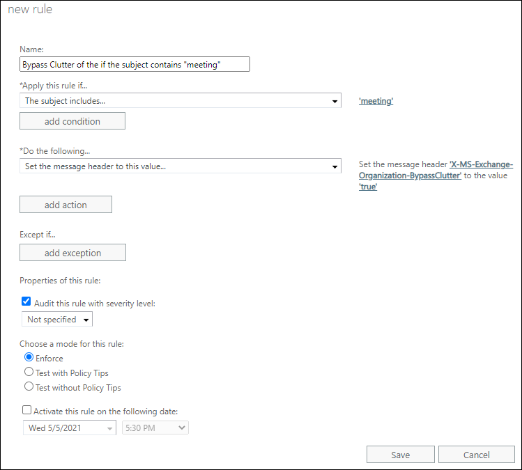

# Use mail flow rules so messages can bypass Clutter in Exchange Online

If you want to be sure that you receive particular messages, you can create a mail flow rule (also known as a transport rule) that makes sure that these messages bypass your Clutter folder. Check out [Use Clutter to sort low-priority messages in Outlook](https://go.microsoft.com/fwlink/p/?LinkId=528411) for more info on Clutter.

For additional management tasks related to mail flow rules, check out [Mail flow rules (transport rules) in Exchange Online](mail-flow-rules.md) and the [New-TransportRule](https://technet.microsoft.com/library/eb3546bf-ca37-474e-9c22-962fe95af276.aspx) PowerShell topic. If you're new to Exchange Online PowerShell, check out [Connect to Exchange Online PowerShell](https://technet.microsoft.com/library/c8bea338-6c1a-4bdf-8de0-7895d427ee5b.aspx).

## What do you need to know before you begin?

- Estimated time to complete: 5 minutes

- You need to be assigned permissions before you can perform this procedure or procedures. To see what permissions you need, see the "Mail flow" entry in the [Feature permissions in Exchange Online](../../permissions-exo/feature-permissions.md) topic.

- For more information about opening and using the Exchange admin center (EAC), see [Exchange admin center in Exchange Online](../../exchange-admin-center.md).

- To learn how to connect to Exchange Online PowerShell, see [Connect to Exchange Online PowerShell](https://go.microsoft.com/fwlink/p/?linkid=396554).

- For information about keyboard shortcuts that may apply to the procedures in this topic, see [Keyboard shortcuts for the Exchange admin center](../../accessibility/keyboard-shortcuts-in-admin-center.md).

## Use the Exchange admin center to create a mail flow rule to bypass the clutter folder

This example allows all messages with title "Meeting" to bypass clutter.

1. In the Exchange admin center (EAC), go to **Mail flow** \> **Rules**. Click **New**  and then choose **Create a new rule...**.

   

2. After you're done creating the new rule, click **Save** to start the rule.

## Use Exchange Online PowerShell to create a mail flow rule to bypass the clutter folder

This example allows all messages with title "Meeting" to bypass clutter.

```
New-TransportRule -Name "<Unique rule name>" -SubjectContainsWords "Meeting" -SetHeaderName "X-MS-Exchange-Organization-BypassClutter" -SetHeaderValue "true"
```

> [!IMPORTANT]
> In this example, both `X-MS-Exchange-Organization-BypassClutter` and `true` are case sensitive.

For detailed syntax and parameter information, see [New-TransportRule](https://technet.microsoft.com/library/eb3546bf-ca37-474e-9c22-962fe95af276.aspx).

## How do you know this worked?

You can check email message headers to see if the email messages are landing in the Inbox due to the Clutter mail flow rule bypass. Pick an email message from a mailbox in your organization that has the Clutter bypass mail flow rule applied. Look at the headers stamped on the message, and you should see the **X-MS-Exchange-Organization-BypassClutter: true** header. This means the bypass is working. Check out the [View the internet header information for an email message](https://go.microsoft.com/fwlink/p/?LinkId=822530) topic for info on how to find the header information.

> [!NOTE]
> Calendar items (accepted, sent, or declined meetings notifications) won't contain this header.

