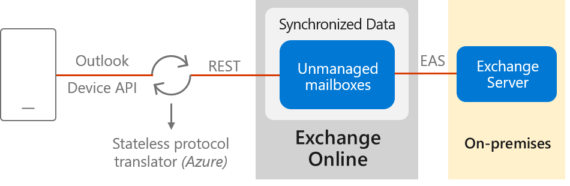

# Using Basic authentication with Outlook for iOS and Android

The Outlook app for iOS and Android is designed to bring together email, calendar, contacts, and other files, enabling users in your organization to do more from their mobile devices. This article provides an overview of the architecture and the storage design of the app, so that Exchange administrators can deploy and maintain Outlook for iOS and Android in their Exchange organizations.

>[!NOTE]
> This article is about using the app in an Exchange 2010, Exchange 2013, Exchange 2016 or Exchange 2019 environment where hybrid modern authentication is **not** enabled. For more information about using hybrid Modern Authentication for on-premises mailboxes with the app, see [Using hybrid Modern Authentication with Outlook for iOS and Android](use-hybrid-modern-auth.md). For information about using the app with Exchange Online, see [Outlook for iOS and Android in Exchange Online](https://go.microsoft.com/fwlink/p/?linkid=845477).

## Outlook for iOS and Android architecture

Outlook for iOS and Android is a cloud-backed application. This means your experience consists of a locally installed app powered by a secure and scalable service running in the Microsoft Cloud.

For Exchange Server mailboxes, Outlook for iOS and Android's new architecture is similar in design to its legacy architecture. However, as the service is now built directly into the Microsoft Cloud (using Office 365 and Microsoft Azure) customers receive the additional benefits of security, privacy, built-in compliance, and transparent operations that Microsoft commits to in the [Microsoft Trust Center](https://www.microsoft.com/trust-center).

The following environments will take advantage of this Office 365-based architecture:

- In Exchange Server 2010 environments

- When a hybrid relationship between Exchange 2013, 2016, or 2019 on-premises and Office 365 has not been configured

- When hybrid Modern Authentication has not been enabled between Exchange 2013, 2016, or 2019 on-premises and Office 365

Data passing from Exchange Online to the Outlook app is passed via a TLS-secured connection. The protocol translator running on Azure serves to route data, commands and notifications, but has no ability to read the data itself.

The Exchange ActiveSync (EAS) connection between Exchange Online and the on-premises environment enables synchronization of the users' on-premises data and includes four weeks of email, all calendar data, all contact data, and out-of-office status. The region in which this data is synchronized into depends on the IP address in use by the mobile device at the time synchronization is setup. If you have a hybrid setup with an Exchange Online tenant, the on-premises data is not synchronized into your tenant; instead, the data is synchronized into Outlook.com. If you want to control and manage your on-premises data from within your tenant, you need to enable [hybrid Modern Authentication with Outlook for iOS and Android](https://docs.microsoft.com/Exchange/clients/outlook-for-ios-and-android/use-hybrid-modern-auth).

Data synchronization between the Exchange on-premises environment and Exchange Online happens independent of user behavior. This ensures that new messages are delivered to the devices very quickly. For more information on how the user authentication model enables data synchronization independently of user behavior, see [Passwords and security in Outlook for iOS and Android for Exchange Server](https://docs.microsoft.com/Exchange/clients/outlook-for-ios-and-android/passwords-and-security).

Processing information in the Microsoft Cloud enables advanced features and capabilities, such as the categorization of email for the Focused Inbox, customized experience for travel and calendar, and improved search speed. Relying on the cloud for intensive processing and minimizing the resources required from users' devices enhances the app's performance and stability. Lastly, it allows Outlook to build features that work across all email accounts, regardless of the technological capabilities of the underlying servers (such as different versions of Exchange Server or Office 365).

>[!IMPORTANT]
> On-premises mailboxes using basic authentication with Outlook for iOS and Android do not support Enterprise Mobility + Security features such as Azure Active Directory conditional access and Intune app protection policies. For support with these technologies, see [Using hybrid Modern Authentication with Outlook for iOS and Android](use-hybrid-modern-auth.md).

## Data security, access, and auditing controls

With on-premises data being synchronized with Exchange Online, customers have questions about how the data is protected in Exchange Online. The white paper [Encryption in the Microsoft Cloud](https://aka.ms/office365ce) discusses how BitLocker is used for volume-level encryption.

By default, Microsoft engineers have zero standing administrative privileges and zero standing access to customer content in Office 365. The white paper [Office 365 Administrative Access Controls](https://aka.ms/office365aac) discusses personnel screening, background checks, Lockbox and Customer Lockbox, and more.

[ISO Audited Controls on Service Assurance](https://sip.protection.office.com/) documentation provides the status of audited controls from global information security standards and regulations that Office 365 has implemented.

## Connectivity Requirements
Microsoft recommends that the on-premises endpoints for AutoDiscover and ActiveSync protocols be opened and accessible from the Internet without any restrictions. In certain situations that may not be possible. If you must place restrictions on your on-premises firewall or gateway edge devices, Microsoft recommends filtering based on FQDN endpoints. If FQDN endpoints cannot be used, then filter on IP addresses. Make sure the following IP subnets and FQDNs are whitelisted:

- All Exchange Online FQDNs and IP subnet ranges as defined in [Office 365 URLs and IP address ranges](https://docs.microsoft.com/office365/enterprise/urls-and-ip-address-ranges).

- The AutoDetect FQDNs and IP subnet ranges defined in [Additional Office 365 IP Addresses and URLs not included in the web services](https://docs.microsoft.com/office365/enterprise/additional-office365-ip-addresses-and-urls). This is required because the AutoDetect service establishes connections to the on-premises infrastructure.

- All Outlook iOS and Android and Office mobile app FQDNs as defined in [Office 365 URLs and IP address ranges](https://docs.microsoft.com/office365/enterprise/urls-and-ip-address-ranges).

## Client features that aren't supported
The following features are not support for on-premises mailboxes using basic authentication with Outlook for iOS and Android:

- Rights protected messages

- Draft folder and Draft messages synchronization

- Shared calendar access and Delegate calendar access

- Shared mailbox data access

- Cortana Time to Leave

- Calendar attachments

- Task management with Microsoft To-Do

- Favorite People with Notifications

- Add-ins

- Interesting Calendars

- Avatar support
