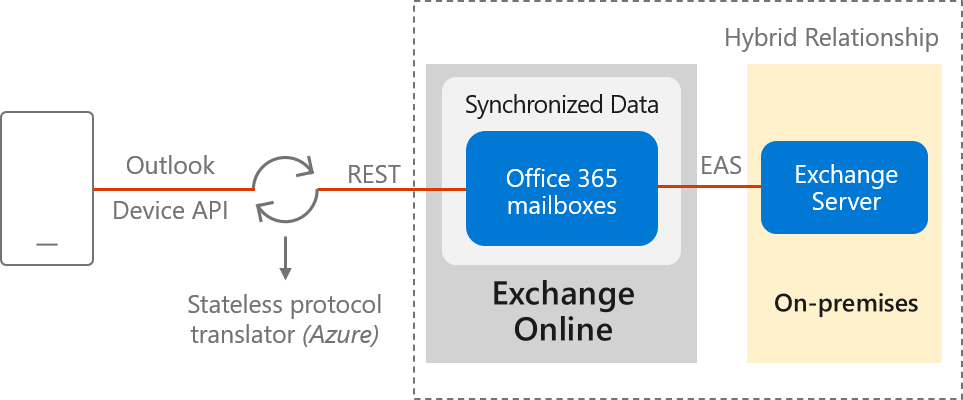
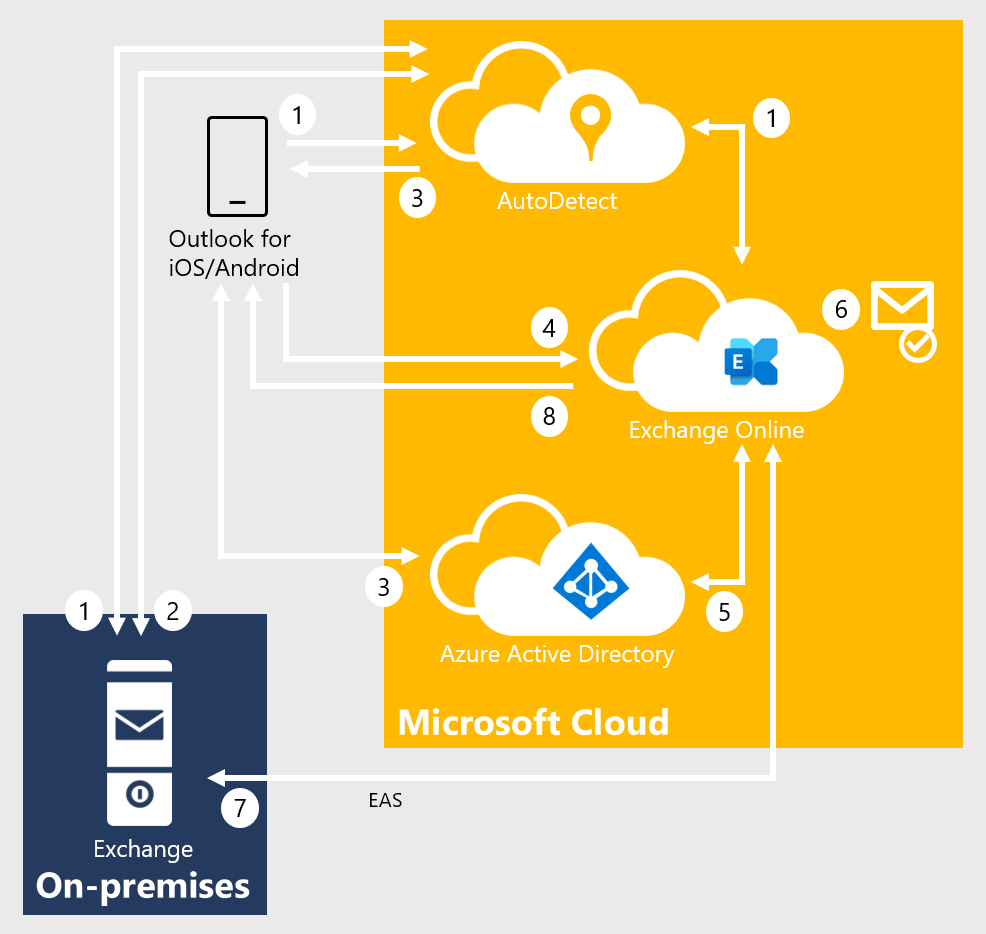

# Using hybrid Modern Authentication with Outlook for iOS and Android

The Outlook app for iOS and Android is designed as the best way to experience Microsoft 365 or Office 365 on your mobile device by using Microsoft services to help find, plan, and prioritize your daily life and work. Outlook provides the security, privacy, and supports you need while protecting corporate data via capabilities such as Azure Active Directory conditional access and Intune app protection policies. The following sections provide an overview of the hybrid Modern Authentication architecture, the required pre-requisites for its deployment, and how to securely deploy Outlook for iOS and Android for Exchange on-premises mailboxes.

## Microsoft Cloud architecture for hybrid Exchange Server customers

Outlook for iOS and Android is a cloud-backed application. This characteristic indicates that your experience consists of a locally installed app powered by a secure and scalable service running in the Microsoft Cloud.

For Exchange Server mailboxes, Outlook for iOS and Android's architecture is built directly into the Microsoft Cloud, providing customers more benefits such as security, privacy, built-in compliance, and transparent operations that Microsoft commits to in the [Microsoft Trust Center](https://microsoft.com/trustcenter) and [Azure Trust Center](https://www.microsoft.com/TrustCenter/CloudServices/Azure).



Within the Microsoft 365 or Office 365-based architecture, Outlook for iOS and Android uses the native Microsoft sync technology for data synchronization that is protected by a TLS-secured connection end-to-end, between Microsoft 365 or Office 365 and the app.

The Exchange ActiveSync (EAS) connection between Exchange Online and the on-premises environment enables synchronization of the users' on-premises data and includes four weeks of email, all calendar data, all contact data, and out-of-office status in your Exchange Online tenant. This data will be removed automatically from Exchange Online after 30 days when the account is deleted in Azure Active Directory.

Data synchronization between the on-premises environment and Exchange Online happens independent of user behavior. This independency ensures that we can send new messages to the devices quickly.

Processing information in the Microsoft Cloud enables advanced features and capabilities, such as the categorization of email for the Focused Inbox, customized experience for travel and calendar, and improved search speed. Relying on the cloud for intensive processing and minimizing the resources required from users' devices enhances the app's performance and stability. Lastly, it allows Outlook to build features that work across all email accounts, regardless of the technological capabilities of the underlying servers (such as different versions of Exchange Server, Microsoft 365, or Office 365).

Specifically, this new architecture has the following improvements:

1. **Enterprise Mobility + Security support**: Customers can take advantage of Microsoft Enterprise Mobility + Security (EMS) including Microsoft Intune and Azure Active Directory Premium, to enable conditional access and Intune app protection policies, which control and secure corporate messaging data on the mobile device.

2. **Fully powered by Microsoft Cloud**: The on-premises mailbox data is synchronized into Exchange Online, which provides the benefits of security, privacy, compliance, and transparent operations that Microsoft commits to in the [Microsoft Trust Center](https://microsoft.com/trustcenter).

3. **OAuth protects users' passwords**: Outlook uses hybrid Modern Authentication (OAuth) to protect users' credentials. Hybrid Modern Authentication provides Outlook with a secure mechanism to access the Exchange data without ever touching or storing a user's credentials. At sign-in, the user authenticates directly against an identity platform (either Azure Active Directory or an on-premises identity provider like ADFS) and receives an access token in return, which grants Outlook access to the user's mailbox or files. The service does not have access to the user's password at any point of time.

4. **Provides Unique Device IDs**: Each Outlook connection is uniquely registered in Microsoft Intune and can therefore be managed as a unique connection.

5. **Unlocks new features on iOS and Android**: This update enables the Outlook app to take advantage of native Microsoft 365 or Office 365 features that are not supported in Exchange on-premises today, such as using full Exchange Online search and Focused Inbox. These features will only be available when using Outlook for iOS and Android.

> [!NOTE]
> Device management through the on-premises Exchange admin center (EAC) is not possible. Intune is required to manage mobile devices.

## Data security, access, and auditing controls

With on-premises data being synchronized with Exchange Online, customers have questions about how the data is protected in Exchange Online. [Encryption in the Microsoft Cloud](/microsoft-365/compliance/office-365-encryption-in-the-microsoft-cloud-overview) discusses how BitLocker is used for volume-level encryption. [Service Encryption with Customer Key](/microsoft-365/compliance/customer-key-overview) is supported in the Outlook for iOS and Android architecture, but note that the user must have an Office 365 Enterprise E5 license (or the corresponding versions of those plans for Government or Education) to have an encryption policy assigned using the set-mailuser cmdlet.

By default, Microsoft engineers have zero standing administrative privileges and zero standing access to customer content in Microsoft 365 or Office 365. [Administrative Access Controls](/compliance/assurance/assurance-administrative-access-controls-overview) discusses personnel screening, background checks, Lockbox and Customer Lockbox, and more.

[ISO Audited Controls on Service Assurance](https://sip.protection.office.com/) documentation provides the status of audited controls from global information security standards and regulations that Microsoft 365 and Office 365 have implemented.

## Connection flow

When Outlook for iOS and Android is enabled with hybrid Modern Authentication, the connection flow is as follows.



1. After the user enters their email address, Outlook for iOS and Android connects to the AutoDetect service. AutoDetect determines the mailbox type by starting an AutoDiscover query to Exchange Online. Exchange Online determines that the user's mailbox is on-premises and returns a 302-redirect to AutoDetect with the on-premises Autodiscover URL. AutoDetect starts a query against the on-premises AutoDiscover service to determine the ActiveSync endpoint for the email address. The URL attempted on-premises is similar to this example: `<https://autodiscover.contoso.com/autodiscover/autodiscover.json?Email=test%40contoso.com&Protocol=activesync&RedirectCount=3>`.

2. AutoDetect starts a connection to the on-premises ActiveSync URL returned in Step 1 above with an empty bearer challenge. The empty bearer challenge tells the on-premises ActiveSync that the client supports Modern Authentication. On-premises ActiveSync responds with a 401-challenge response and includes the *WWW-Authenticate: Bearer* header. Within the WWW-Authenticate: Bearer header is the authorization_uri value that identifies the Azure Active Directory (AAD) endpoint that should be used to obtain an OAuth token.

3. AutoDetect returns the AAD endpoint to the client. The client begins the log-in flow and the user is presented with a Web form (or redirected to the Microsoft Authenticator app) and can enter credentials. Depending on the identity configuration, this process may or may not involve a federated endpoint redirect to an on-premises identity provider. Ultimately, the client obtains an access-and-refresh token pair, which is named AT1/RT1. This access token is scoped to the Outlook for iOS and Android client with an audience of the Exchange Online endpoint.

4. Outlook for iOS and Android establishes a connection to Exchange Online and issues a provisioning request that includes the user's access token (AT1) and the on-premises ActiveSync endpoint.

5. The MRS provisioning API within Exchange Online uses AT1 as input and obtains a second access-and-refresh token pair (named AT2/RT2) to access the on-premises mailbox via an on-behalf-of call to Active Directory. This second access token is scoped with the client being Exchange Online and an audience of the on-premises ActiveSync namespace endpoint.

6. If the mailbox isn't provisioned, then the provisioning API creates a mailbox.

7. The MRS provisioning API establishes a secure connection to the on-premises ActiveSync endpoint and synchronizes the user's messaging data using the AT2 access token as the authentication mechanism. RT2 is used periodically to generate a new AT2 so that data can be synchronized in the background without user intervention.

8. Data is returned to the client.

## Technical and licensing requirements

The hybrid Modern Authentication architecture has the following technical requirements:

> [!NOTE]
> On-premises accounts leveraging hybrid Modern Authentication with Outlook mobile are not supported with Office 365 US Government Community and Defense tenants, Office 365 Germany tenants, and Office 365 China operated by 21Vianet tenants.

1. **Exchange on-premises setup**:
   - Exchange Server 2019 Cumulative Update 1 (CU1) or later, Exchange Server 2016 Cumulative Update 8 (CU8) or later, or Exchange Server 2013 CU19 or later on all Exchange servers. In hybrid deployments (on-premises Exchange and Exchange Online) or in organizations that use Exchange Online Archiving (EOA) with their on-premises Exchange deployment, you need to deploy the most current CU or one CU prior to the most current.

   - All Exchange 2007 or Exchange 2010 servers must be removed from the environment. These versions of Exchange are out of mainstream support and won't work with Intune-managed Outlook for iOS and Android. In this architecture, Outlook for iOS and Android uses OAuth as the authentication mechanism. One of the on-premises configuration changes that occur enables the OAuth endpoint to the Microsoft Cloud as the default authorization endpoint. When this change is made, clients can start negotiating the use of OAuth. Because this change spans the whole organization, Exchange 2010 mailboxes fronted by either Exchange 2013 or 2016 will incorrectly think they can do OAuth and will end up in a disconnected state, since Exchange 2010 doesn't support OAuth as an authentication mechanism.

2. **Active Directory Synchronization**. Active Directory synchronization of the entire on-premises mail recipient directory with Azure Active Directory, via Azure AD Connect. If you have **Azure AD app and attribute filtering** enabled in Azure AD Connect configuration, ensure that the following applications are selected:
   - Office 365 ProPlus
   - Exchange Online
   - Azure RMS
   - Intune

    If you don't have **Azure AD app and attribute filtering** enabled in Azure AD Connect configuration, all required applications are already selected by default.

    > [!IMPORTANT]
    > Outlook for iOS and Android uses the tenant's Exchange Online Global Address List for on-premises mailboxes that leverage hybrid Modern Authentication. If all mail recipients are not synchronized into Azure Active Directory, users will experience mail flow issues.

3. **Exchange hybrid setup**: Requires full hybrid relationship between Exchange on-premises with Exchange Online.
   - A hybrid Microsoft 365 or Office 365 organization is configured in full hybrid configuration using Exchange Classic Hybrid Topology mode and is set up as specified in the [Exchange Deployment Assistant](https://assistants.microsoft.com/).

       > [!NOTE]
       > Hybrid Modern Authentication is not supported with the [Hybrid Agent](../../../ExchangeHybrid/hybrid-deployment/hybrid-agent.md).

   - Requires a Microsoft 365 or Office 365 Enterprise, Business, or Education organization.
   - The on-premises mailbox data is synchronized in the same datacenter region where that Microsoft 365 or Office 365 organization is set up or to the datacenter region defined in the account's **PreferredDataLocation**. For more information about where Microsoft 365 and Office 365 data is located, visit the [Microsoft Trust Center](https://microsoft.com/trustcenter). For more information on **PreferredDataLocation**, see [Multi-Geo Capabilities](/office365/enterprise/multi-geo-capabilities-in-exchange-online). 
   - The external URL host names for Exchange ActiveSync and AutoDiscover must be published as service principals to Azure Active Directory through the Hybrid Configuration Wizard.
   - AutoDiscover and Exchange ActiveSync namespaces must be accessible from the Internet and cannot be fronted by a pre-authentication solution.

   - Ensure SSL or TLS offloading isn't being used between the load balancer and your Exchange servers, as this set up will affect the use of the OAuth token. SSL and TLS bridging (termination and re-encryption) is supported.

4. **Intune setup**: Both Intune standalone and [Co-Management](/sccm/comanage/overview) deployments are supported (Basic Mobility and Security for Microsoft 365 isn't supported).

5. **Microsoft 365 and Office 365 licensing**:
   - Outlook for iOS and Android is free for consumer usage from the iOS App store and from Google Play. However, commercial users require a Microsoft 365 or Office 365 subscription that includes the Office desktop applications: Microsoft 365 Apps for Business, Microsoft 365 Business Standard, Microsoft 365 Apps for enterprise, Office 365 Enterprise E3, Office 365 Enterprise E5, or the corresponding versions of those plans for Government or Education. Commercial users with the following subscriptions are allowed to use the Outlook mobile app on devices with integrated screens 10.1" diagonally or less: Office 365 Enterprise E1, Office 365 F1, Office 365 A1, Microsoft 365 Business Basic, and if you only have an Exchange Online license (without Office). If you only have an Exchange on-premises (Exchange Server) license, you aren't licensed to use the app.
   - Use of advanced Exchange Online features (for example, [Service Encryption with Customer Key](/microsoft-365/compliance/customer-key-set-up) or [Multi-Geo Capabilities](/office365/enterprise/multi-geo-capabilities-in-exchange-online)) require the on-premises user to be assigned the applicable Office 365 or Microsoft 365 subscription license within the Microsoft 365 Admin Center.

   For more information on how to assign a license, see [Add users individually or in bulk](/microsoft-365/admin/add-users/add-users).

6. **EMS licensing**: Each on-premises user must have one of the following licenses:
   - Intune standalone + Azure Active Directory Premium 1 or Azure Active Directory Premium 2
   - Enterprise Mobility + Security E3, Enterprise Mobility + Security E5

## Implementation steps

Enabling support for hybrid Modern Authentication in your organization requires each of the following steps, which are detailed in the following sections:

1. Create a conditional access policy
2. Create an Intune app protection policy
3. Enable hybrid Modern Authentication

### Create a conditional access policy

When an organization decides to standardize how users access Exchange data, using Outlook for iOS and Android as the only email app for end users, they can configure a conditional access policy that blocks other mobile access methods. Outlook for iOS and Android authenticates via the Azure Active Directory identity object and then connects to Exchange Online. Therefore, you'll need to create Azure Active Directory conditional access policies to restrict mobile device connectivity to Exchange Online. To do this task, you'll need two conditional access policies, with each policy targeting all potential users. Details on creating these policies can be found in [Conditional Access: Require approved client apps or app protection policy](/azure/active-directory/conditional-access/howto-policy-approved-app-or-app-protection).

1. Follow the steps in [Require approved client apps or app protection policy with mobile devices](/azure/active-directory/conditional-access/howto-policy-approved-app-or-app-protection#require-approved-client-apps-or-app-protection-policy-with-mobile-devices). This policy allows Outlook for iOS and Android, but blocks OAuth and basic authentication capable Exchange ActiveSync mobile clients from connecting to Exchange Online.

   > [!NOTE]
   > This policy ensures mobile users can access all Office endpoints using the applicable apps.

2. Follow the steps in [Block Exchange ActiveSync on all devices](/azure/active-directory/conditional-access/howto-policy-approved-app-or-app-protection#block-exchange-activesync-on-all-devices), which prevents Exchange ActiveSync clients using basic authentication on non-mobile devices from connecting to Exchange Online.

   The above policies use the grant control [Require app protection policy](/azure/active-directory/active-directory-conditional-access-technical-reference), which ensures that an Intune App Protection Policy is applied to the associated account within Outlook for iOS and Android prior to granting access. If the user isn't assigned to an Intune App Protection Policy, isn't licensed for Intune, or the app isn't included in the Intune App Protection Policy, then the policy prevents the user from obtaining an access token and gaining access to messaging data.

3. Finally, follow [How to: Block legacy authentication to Azure AD with Conditional Access](/azure/active-directory/conditional-access/block-legacy-authentication) to block legacy authentication for other Exchange protocols on iOS and Android devices; this policy should target only Microsoft 365 or Office 365 Exchange Online cloud app and iOS and Android device platforms. This approach ensures mobile apps using Exchange Web Services, IMAP4, or POP3 protocols with basic authentication can't connect to Exchange Online.

> [!IMPORTANT]
> To leverage app-based conditional access policies, the Microsoft Authenticator app must be installed on iOS devices. For Android devices, the Intune Company Portal app is required. For more information, see [App-based conditional access with Intune](/intune/app-based-conditional-access-intune).

To block other mobile device clients (such as the native mail client included in the mobile operating system) from connecting to your on-premises environment (which authenticate via basic authentication against on-premises Active Directory):

You can use the built-in Exchange mobile device access rules and block all mobile devices from connecting by setting the following command in the Exchange Management Shell:

```powershell
Set-ActiveSyncOrganizationSettings -DefaultAccessLevel Block
```

> [!NOTE]
> When implementing the above on-premises cmdlet, be aware that it may impact users connecting to Exchange on-premises with their mobile devices.

### Create an Intune app protection policy

After hybrid Modern Authentication is enabled, all on-premises mobile users can use Outlook for iOS and Android using the Microsoft 365 or Office 365-based architecture. Therefore, it's important to protect corporate data with an Intune app protection policy.

Create Intune app protection policies for both iOS and Android using the steps documented in [How to create and assign app protection policies](/intune/app-protection-policies). At a minimum, each policy must fulfil the following conditions:

1. They include all Microsoft mobile applications, such as Word, Excel, or PowerPoint, as this inclusion will ensure that users can access and manipulate corporate data within any Microsoft app in a secure fashion.

2. They mimic the security features that Exchange provides for mobile devices, including:
   - Requiring a PIN for access (which includes Select Type, PIN length, Allow Simple PIN, Allow fingerprint)
   - Encrypting app data
   - Blocking managed apps from running on "jailbroken" and rooted devices

3. They're assigned to all users. This wide assignation ensures that all users are protected, regardless of whether they use Outlook for iOS and Android.

In addition to the above minimum policy requirements, you should consider deploying advanced protection policy settings like **Restrict cut, copy, and paste with other apps** to further prevent corporate data leakage. For more information on the available settings, see [Android app protection policy settings in Microsoft Intune](/intune/app-protection-policy-settings-android) and [iOS app protection policy settings](/intune/app-protection-policy-settings-ios).

> [!IMPORTANT]
> To apply Intune app protection policies against apps on Android devices that are not enrolled in Intune, the user must also install the Intune Company Portal. For more information, see [What to expect when your Android app is managed by app protection policies](/intune/app-protection-enabled-apps-android).

### Enable hybrid Modern Authentication

1. If you haven't enabled hybrid Modern Authentication, review the prerequisites as outlined in [Hybrid Modern Authentication overview and prerequisites for using it with on-premises Skype for Business and Exchange servers](/office365/enterprise/hybrid-modern-auth-overview). After you've completed the prerequisites, do the steps in [How to configure Exchange Server on-premises to use hybrid Modern Authentication](/office365/enterprise/configure-exchange-server-for-hybrid-modern-authentication).

2. Create an Exchange on-premises device access allow rule to allow Exchange Online to connect to your on-premises environment using the ActiveSync protocol:

   ```powershell
   If ((Get-ActiveSyncOrganizationSettings).DefaultAccessLevel -ne "Allow") {New-ActiveSyncDeviceAccessRule -Characteristic DeviceType -QueryString "OutlookService" -AccessLevel Allow}
   ```

   > [!NOTE]
   > Device management through the on-premises Exchange admin center is not possible. Intune is required to manage mobile devices.

3. Create an Exchange on-premises device access rule that prevents users from connecting to the on-premises environment with Outlook for iOS and Android with basic authentication over the Exchange ActiveSync protocol:

   ```powershell
   New-ActiveSyncDeviceAccessRule -Characteristic DeviceModel -QueryString "Outlook for iOS and Android" -AccessLevel Block
   ```

   > [!NOTE]
   > Once this rule is created, Outlook for iOS and Android with Basic authentication users will be blocked.

3. Ensure your on-premises Exchange ActiveSync maxRequestLength is configured to match your transport configuration's MaxSendSize/MaxReceiveSize:
   - Path: `%ExchangeInstallPath%\FrontEnd\HttpProxy\Sync\web.config`
   - Property: `maxRequestLength`
   - Value: set in KB size (10 MB is 10240, for example)

## Client features that aren't supported

The following features aren't supported for on-premises mailboxes using hybrid Modern Authentication with Outlook for iOS and Android.

- Draft folder and Draft messages synchronization
- Viewing more than four weeks of email by using the "Load More Messages" link at the bottom of the message list
- Shared calendar access and delegate calendar access
- Shared and delegate mailbox data access
- Cortana Time to Leave / Travel Time
- Rich meeting locations
- Task management with Microsoft To Do
- Add-ins
- Interesting Calendars
- Play My Emails
- Sensitivity labeling
- S/MIME

The following features are only supported when the on-premises infrastructure uses Exchange Server 2016 and later:

- Calendar attachments

## Connection Flow FAQ

**Q**: My organization has a security policy that requires Internet inbound connections to be restricted to approved IP addresses or FQDNs. Is that configuration possible with this architecture?

**A**: Microsoft recommends that the on-premises endpoints for AutoDiscover and ActiveSync protocols be opened and accessible from the Internet without any restrictions. In certain situations that may not be possible. For example, if you're in a coexistence period with another third-party unified endpoint management (UEM) solution, you may want to place restrictions on the ActiveSync protocol to prevent users from bypassing the UEM solution while you migrate to Intune and Outlook for iOS and Android. If you must place restrictions on your on-premises firewall or gateway edge devices, Microsoft recommends filtering based on FQDN endpoints. If FQDN endpoints cannot be used, then filter on IP addresses. Make sure the following IP subnets and FQDNs are included on your allowlist:

- All Exchange Online FQDNs and IP subnet ranges as defined in [More endpoints not included in the Microsoft 365 or Office 365 IP Address and URL Web service](/office365/enterprise/urls-and-ip-address-ranges).

- The AutoDetect FQDNs and IP subnet ranges defined in [Additional endpoints not included in the Microsoft 365 or Office 365 IP Address and URL Web service](/office365/enterprise/additional-office365-ip-addresses-and-urls). These IP subnets and FQDNs are required because the AutoDetect service establishes connections to the on-premises infrastructure.

- All Outlook iOS and Android and Office mobile app FQDNs as defined in [Microsoft 365 and Office 365 URLs and IP address ranges](/office365/enterprise/urls-and-ip-address-ranges).

**Q**: My organization currently uses a third-party UEM solution to control mobile device connectivity. If I expose the Exchange ActiveSync namespace on the Internet, that introduces a way for users to bypass the third-party UEM solution during the coexistence period. How can I prevent this situation?

**A**: There are three potential solutions to resolving this issue:

1. Implement Exchange mobile device access rules to control which devices are approved to connect.
2. Some third-party UEM solutions integrate with Exchange mobile device access rules, blocking unapproved access, while adding approved devices in the user's ActiveSyncAllowedDeviceIDs property.
3. Implement IP restrictions on the Exchange ActiveSync namespace.

**Q**: Can I use Azure ExpressRoute for managing traffic between the Microsoft Cloud and my on-premises environment?

**A**: Connectivity to the Microsoft Cloud requires Internet connectivity. Microsoft recommends exposing AutoDiscover and Exchange ActiveSync directly to the Internet; for more information, see [Microsoft 365 and Office 365 Network Connectivity Principles](/office365/enterprise/office-365-network-connectivity-principles). However, Azure ExpressRoute is supported for Exchange hybrid scenarios. For more information, see [Azure ExpressRoute for Microsoft 365 and Office 365](/office365/enterprise/azure-expressroute).

With ExpressRoute, there's no private IP space for ExpressRoute connections, nor can there be "private" DNS resolution. That means that any endpoint your company wants to use over ExpressRoute must resolve in public DNS. If that endpoint resolves to an IP that is contained in the advertised prefixes associated with the ExpressRoute circuit (your company must configure those prefixes in the Azure portal when you enable Microsoft peering on the ExpressRoute connection), then the outbound connection from Exchange Online to your on-premises environment will route through the ExpressRoute circuit. Your company will have to ensure that the return traffic associated with these connections goes through the ExpressRoute circuit (avoiding asymmetric routing).

> [!IMPORTANT]
> Because your company will be adding the Exchange AutoDiscover and ActiveSync namespaces to the advertised prefixes in the ExpressRoute circuit, the only way to reach the Exchange AutoDiscover and ActiveSync endpoints will be via the ExpressRoute. In other words, the only mobile device that will be able to connect to on-premises via the AutoDiscover and ActiveSync namespaces will be Outlook for iOS and Android. All other clients (such as mobile devices' native mail clients) will be unable to connect to the on-premises environment as the connection will not be established from the Microsoft Cloud. This is because there cannot be any overlaps of the public IP space advertised to Microsoft on the ExpressRoute circuit and the public IP space advertised on your Internet circuit(s).

**Q**: Given only four weeks of message data are synchronized to Exchange Online, does this mean that search queries executed in Outlook for iOS and Android can't return information beyond the data available on the local device?

**A**: When a search query is performed in Outlook for iOS and Android, items that match the search query are returned if they are located on the device. In addition, the search query is passed to Exchange on-premises via Exchange Online. Exchange on-premises executes the search query against the on-premises mailbox and returns the results to Exchange Online, which relays the results to the client. The on-premises query results are stored in Exchange Online for one day before being deleted.

**Q**: How do I know that the email account is added correctly in Outlook for iOS and Android?

**A**: On-premises mailboxes that are added via hybrid Modern Authentication are labeled as **Exchange (Hybrid)** in the account settings in Outlook for iOS and Android, similar to the following example:


## Authentication FAQ

**Q**: What identity configurations are supported with hybrid Modern Authentication and Outlook for iOS and Android?

**A**: The following identity configurations with Azure Active Directory are supported with hybrid Modern Authentication:

- Federated Identity with any on-premises identity provider that is supported by Azure Active Directory
- Password Hash Synchronization via Azure Active Directory Connect
- Pass-through Authentication via Azure Active Directory Connect

**Q**: What authentication mechanism is used for Outlook for iOS and Android? Are credentials stored in Microsoft 365 or Office 365?

**A**: See [Account setup with modern authentication in Exchange Online](../../../ExchangeOnline/clients-and-mobile-in-exchange-online/outlook-for-ios-and-android/setup-with-modern-authentication.md).

**Q**: Do Outlook for iOS and Android and other Microsoft Office mobile apps support single sign-on?

**A**: See [Account setup with modern authentication in Exchange Online](../../../ExchangeOnline/clients-and-mobile-in-exchange-online/outlook-for-ios-and-android/setup-with-modern-authentication.md).

**Q**: What is the lifetime of the tokens generated and used by the Active Directory Authentication Library (ADAL) in Outlook for iOS and Android?

**A**: See [Account setup with modern authentication in Exchange Online](../../../ExchangeOnline/clients-and-mobile-in-exchange-online/outlook-for-ios-and-android/setup-with-modern-authentication.md).

**Q**: What happens to the access token when a user's password is changed?

**A**: See [Account setup with modern authentication in Exchange Online](../../../ExchangeOnline/clients-and-mobile-in-exchange-online/outlook-for-ios-and-android/setup-with-modern-authentication.md).

**Q**: Is there a way for a user to bypass AutoDetect when adding their account to Outlook for iOS and Android?

**A**: Yes, a user can bypass AutoDetect at any time and manually configure the connection using Basic authentication over the Exchange ActiveSync protocol. To ensure that the user doesn't establish a connection to your on-premises environment via a mechanism that doesn't support Azure Active Directory Conditional Access or Intune app protection policies, the on-premises Exchange Administrator needs to configure an Exchange device access rule that blocks the ActiveSync connection. To do this task, type the following command in the Exchange Management Shell:

```powershell
New-ActiveSyncDeviceAccessRule -Characteristic DeviceModel -QueryString "Outlook for iOS and Android" -AccessLevel Block
```

**Q**: What happens when an organization moves from basic authentication with Outlook for iOS and Android to hybrid Modern authentication?

**A**: After an organization enables hybrid modern authentication following the above [Implementation steps](#implementation-steps), end users need to delete their existing account profile in Outlook for iOS and Android as the profile uses basic authentication. End users can then create a new profile which will use hybrid Modern authentication.

## Troubleshooting

Below are the most common issues or errors with on-premises mailboxes using hybrid Modern Authentication with Outlook for iOS and Android.

### AutoDiscover and ActiveSync

During profile creation, the user should be presented a Modern Authentication dialog similar to the one in the following screenshot:


If, instead, the user is presented with one of the following dialogs, then there's an issue with either the Autodiscover or ActiveSync on-premises endpoints.

Here's an example of a user being presented with the legacy Basic authentication Exchange ActiveSync experience:


And here's an example of what users see when AutoDetect isn't able to discover the configuration for users' on-premises mailboxes.


In either scenario, verify that your on-premises environment is correctly configured. To do this task: from the TechNet Gallery, download and execute the script for [Validating Hybrid Modern Authentication setup for Outlook for iOS and Android](https://aka.ms/OLHMAScript).

When you review the output from the script, you should be seeing the following output from AutoDiscover:

```json
{
    "Protocol": "activesync",
    "Url": "https://mail.contoso.com/Microsoft-Server-ActiveSync"
}
```

The on-premises ActiveSync endpoint should return the following response, where the WWW-Authenticate header includes an authorization_uri:

```console
Content-Length →0
Date →Mon, 29 Jan 2018 19:51:46 GMT
Server →Microsoft-IIS/10.0 Microsoft-HTTPAPI/2.0
WWW-Authenticate →Bearer client_id="00000002-0000-0ff1-ce00-000000000000", trusted_issuers="00000001-0000-0000-c000-000000000000@5de110f8-2e0f-4d45-891d-bcf2218e253d,00000004-0000-0ff1-ce00-000000000000@contoso.com", token_types="app_asserted_user_v1 service_asserted_app_v1", authorization_uri="https://login.windows.net/common/oauth2/authorize"
Www-Authenticate →Basic realm="mail.contoso.com"
X-Powered-By →ASP.NET
request-id →5ca2c827-5147-474c-8457-63c4e5099c6e
```

If the AutoDiscover or ActiveSync responses aren't similar to the above examples, you can investigate the following causes to be the possible ones:

1. If the AutoDiscover endpoint cannot be reached, then it's likely there's a firewall or load balancer configuration issue (for example, IP restrictions are configured and the required IP ranges aren't present). Also, there may be a device in front of Exchange requiring pre-authentication to access the AutoDiscover endpoint.
2. If the AutoDiscover endpoint doesn't return the correct URL, then there's a configuration issue with the ActiveSync virtual directory's ExternalURL value.
3. If the ActiveSync endpoint cannot be reached, then there's a firewall or load balancer configuration issue. Again, one example is IP restrictions are configured and the required IP ranges aren't present. Also, there may be a device in front of Exchange requiring pre-authentication to access the ActiveSync endpoint.
4. If the ActiveSync endpoint doesn't contain an authorization_uri value, verify that the EvoSTS authentication server is configured as the default endpoint using Exchange Management Shell:

   ```powershell
   Get-AuthServer EvoSts | Format-List IsDefaultAuthorizationEndpoint
   ```

5. If the ActiveSync endpoint doesn't contain a WWW-Authenticate header, then a device in front of Exchange may be responding to the query.

### Client synchronization issues

There are a few scenarios that can result in data being stale in Outlook for iOS and Android. Typically, this data condition is due to an issue with the second access token (the token used by MRS in Exchange Online to synchronize the data with the on-premises environment). The two most common reasons for this issue are:

 - SSL/TLS offloading on-premises.
 - EvoSTS certificate metadata issues.

With SSL/TLS offloading, tokens are issued for a specific uri and that value includes the protocol value ("https://"). When the load balancer offloads SSL/TLS, the request received by Exchange comes in via HTTP, resulting in a claim mismatch due to the protocol value being http://. The following example depicts a response header from a Fiddler trace:

```console
Content-Length →0
Date →Mon, 29 Jan 2018 19:51:46 GMT
Server →Microsoft-IIS/10.0 Microsoft-HTTPAPI/2.0
WWW-Authenticate →Bearer client_id="00000002-0000-0ff1-ce00-000000000000", trusted_issuers="00000001-0000-0000-c000-000000000000@00c118a9-2de9-41d3-b39a-81648a7a5e4d", authorization_uri="https://login.windows.net/common/oauth2/authorize", error="invalid_token"
WWW-Authenticate →Basic realm="mail.contoso.com"
X-Powered-By →ASP.NET
request-id →2323088f-8838-4f97-a88d-559bfcf92866
x-ms-diagnostics →2000003;reason="The hostname component of the audience claim value is invalid. Expected 'https://mail.contoso.com'. Actual 'http://mail.contoso.com'.";error_category="invalid_resource"
```

As specified above in the section *Technical and licensing requirements*, SSL/TLS offloading isn't supported for OAuth flows.

For EvoSTS Certificate Metadata, the certificate metadata used by EvoSTS is occasionally updated in Microsoft 365 or Office 365. The Exchange on-premises arbitration mailbox that has the organization capability of "OrganizationCapabilityManagement" is responsible for detecting the changes and for updating the corresponding metadata on-premises; this process executes every eight hours.

Exchange Administrators can find this mailbox by executing the following cmdlet using Exchange Management Shell:

```powershell
$x=Get-mailbox -arbitration | ? {$_.PersistedCapabilities -like "OrganizationCapabilityManagement"};Get-MailboxDatabaseCopyStatus $x.database.name
```

On the server hosting the database for the OrganizationCapabilityManagement arbitration mailbox, review the application event logs for events with a source of **MSExchange AuthAdmin**. The events should tell you if Exchange can refresh the metadata. If the metadata is out of date, you can manually refresh it with this ccmdlet:

```powershell
Set-AuthServer EvoSts -RefreshAuthMetadata
```

You can also create a scheduled task that executes the above command every 24 hours.

### Exchange Online statistics

You can use the following Exchange Online cmdlets to see statistical information for each synchronized on-premises mailbox.

1. First, obtain the location of the synchronized on-premises mailbox in the tenant, specifying the on-premises mailbox's identity (for example, jane@contoso.com).

    ```PowerShell
    $m = Get-MailboxLocation <identity>
    ```

2. To see mailbox-related statistics, use

    ```PowerShell
    Get-MailboxStatistics $m.id
    ```

3. To see mobile device statistics (like seeing when Outlook for iOS and Android last synchronized to Exchange Online), use

    ```PowerShell
    Get-MobileDeviceStatistics -Mailbox $m.id
    ```

For more information, see [Get-MailboxStatistics](/powershell/module/exchange/get-mailboxstatistics) and [Get-MobileDeviceStatistics](/powershell/module/exchange/get-mobiledevicestatistics).

### Other issues

There are other issues that may prevent hybrid Modern Authentication from functioning correctly. For more information, see the troubleshooting section in [Announcing Hybrid Modern Authentication for Exchange On-Premises](https://techcommunity.microsoft.com/t5/Exchange-Team-Blog/Announcing-Hybrid-Modern-Authentication-for-Exchange-On-Premises/ba-p/607476).
