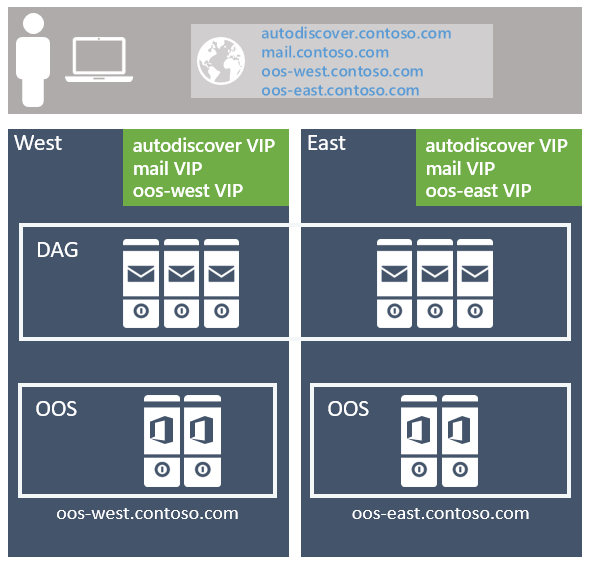
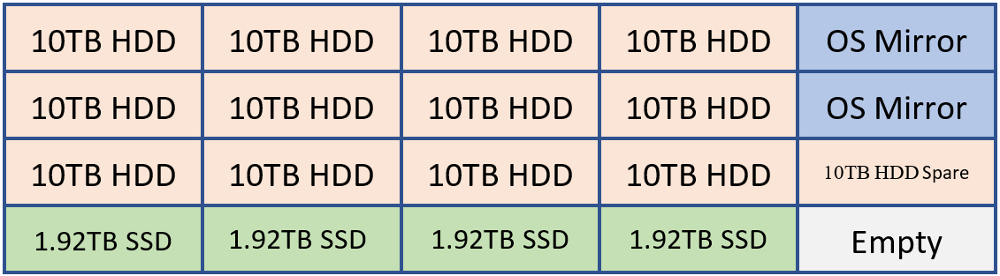

# Exchange 2019 preferred architecture

With each new release of Exchange Server for our on-premises customers, we update our Preferred Architecture and discuss what changes we would like our customers to be aware of. Exchange Server 2013 brought us [the first of the Preferred Architectures](https://techcommunity.microsoft.com/t5/Exchange-Team-Blog/The-Preferred-Architecture/ba-p/586755) in modern Exchange history and was then followed [with a refresh](https://techcommunity.microsoft.com/t5/Exchange-Team-Blog/The-Exchange-2016-Preferred-Architecture/ba-p/604024) for Exchange Server 2016 by providing refinements for the changes that came with the 2016 release. With this update for Exchange Server 2019, we'll iterate on the previous PA to take advantage of new technologies and improvements.

## The preferred architecture

The PA is the Exchange Server Engineering Team's best practice recommendation for what we believe is the best deployment architecture for Exchange Server 2019 in an on-premises environment.

While Exchange 2019 offers a wide variety of architectural choices for on-premises deployments, the architecture discussed here is the most scrutinized one. While there are other supported deployment architectures, they aren't our recommended practice.

Following the PA helps customers become a member of a community of organizations with similar Exchange Server deployments. This strategy allows easier knowledge sharing and provides a more rapid response to unforeseen circumstances. Our own support organization is aware what an Exchange Server PA deployment should look like and prevents them from spending lengthy cycles learning and understanding a customer's highly custom environment before working with them towards a support case resolution.

The PA is designed with several business requirements in mind, such as the requirement that the architecture be able to:

- Include both high availability within the datacenter, and site-resilience between datacenters

- Support multiple copies of each database, thereby allowing for quick activation

- Reduce the cost of the messaging infrastructure

- Increase availability by optimizing around failure domains and reducing complexity

The specific prescriptive nature of the PA means that not every customer will be able to deploy it word for word. For example, not all our customers have multiple data centers. Some of our customers may have different business requirements or internal policies they must adhere to which necessitate a different deployment architecture. If you fall into those categories, and you want to deploy Exchange on-premises, there are still advantages to adhering as closely as possible to the PA and deviate only where your requirements or policies force you to differ. Alternatively, you can always consider Microsoft 365 or Office 365 where you no longer must deploy or manage a large number of servers.

The PA removes complexity and redundancy where necessary to drive the architecture to a predictable recovery model: when a failure occurs, another copy of the affected database is activated.

The PA covers the following four areas of focus:

1. [Namespace design](#namespace-design)

2. [Site-resilient datacenter pair design](#site-resilient-datacenter-pair-design)

3. [Server design](#server-design)

4. [Database availability group design](#database-availability-group-design)

For Exchange Server 2019, we have no changes in three of the four categories from the Exchange Server 2016 Preferred Architecture. The areas of Namespace design, Datacenter design, and DAG design are receiving no major changes. We have been pleased with customer deployments that closely followed the Exchange Server 2016 PA and see no need to deviate from the recommendations in those areas.

The most noteworthy changes in the Exchange Server 2019 PA focus on the area of Server design due to some new and exciting technologies.

## Namespace design

In the [Namespace Planning](https://techcommunity.microsoft.com/t5/Exchange-Team-Blog/Namespace-Planning-in-Exchange-2016/ba-p/604072) and [Load Balancing Principles](https://techcommunity.microsoft.com/t5/Exchange-Team-Blog/Load-Balancing-in-Exchange-2016/ba-p/604048) articles for Exchange Server 2016, Ross Smith IV outlined the various configuration choices that were available with Exchange 2016 and these concepts continue to apply for Exchange Server 2019. For the namespace, the choices are to either deploy a [bound namespace](https://techcommunity.microsoft.com/t5/Exchange-Team-Blog/Namespace-Planning-in-Exchange-2016/ba-p/604072#bound) (having a preference for the users to operate out of a specific datacenter) or an [unbound namespace](https://techcommunity.microsoft.com/t5/Exchange-Team-Blog/Namespace-Planning-in-Exchange-2016/ba-p/604072#unbound) (having the users connect to any datacenter without preference).

The recommended approach is to use the unbounded model, deploying a single Exchange namespace per client protocol for the site-resilient datacenter pair (where each datacenter is assumed to represent its own Active Directory site - see more details on that below). For example:

- For the Autodiscover service: autodiscover.contoso.com

- For HTTP clients: mail.contoso.com

- For IMAP clients: imap.contoso.com

- For SMTP clients: smtp.contoso.com

Each Exchange namespace is load balanced across both datacenters in a layer 7 configuration that doesn't use session affinity, resulting in 50 percent of traffic being proxied between datacenters. Traffic is equally distributed across the datacenters in the site-resilient pair, via round robin DNS, geo-DNS, or other similar solutions. From our perspective, the simpler solution is the least complex and easier to manage, so our recommendation is to use round robin DNS.

One caution we have for customers is to ensure you assign a low TTL (time to live) value for any DNS record associated with your Exchange architecture. If a full datacenter outage happens when you're using round robin DNS, you must maintain the ability to quickly update your DNS records. You'll need to remove the IP addresses from the offline datacenter so they aren't returned for DNS queries. For example, if your DNS records have a longer TTL value of 24 hours it may take up to a day for downstream DNS caches to properly update. If you don't do this step, you may find some clients are unable to properly transition to the still available IP addresses in your remaining datacenter. Don't forget to add the IP addresses back to your DNS records when your previously offline datacenter is recovered and ready to host services once again.

Data center affinity is required for the Office Online Server farms, thus a namespace is deployed per datacenter with the load balancer utilizing layer 7, and maintaining session affinity via cookie-based persistence.



If you have multiple site-resilient datacenter pairs in your environment, you'll need to decide if you want to have a single worldwide namespace, or if you want to control the traffic to each specific datacenter by using regional namespaces. Your decision depends on your network topology and the associated cost with using an unbound model; for example, if you have datacenters located in North America and South Africa, the network link between these regions might not only be costly, but it might also have high latency, which can introduce user pain and operational issues. In that case, it makes sense to deploy a bound model with a separate namespace for each region. However, options like geographical DNS offer you the ability to deploy a single unified namespace, even when you have costly network links; geo-DNS allows you to have your users directed to the closest datacenter based on their client's IP address.

## Site-resilient datacenter pair design

To achieve a highly available *and* site-resilient architecture, you must have two or more datacenters that are well connected (ideally, you want a low round-trip network latency, otherwise replication and the client experience are adversely affected). In addition, the datacenters should be connected via redundant network paths supplied by different operating carriers.

While we support stretching an Active Directory site across multiple datacenters, for the PA we recommend that each datacenter be its own Active Directory site. There are two reasons:

1. Transport site-resilience via [Shadow redundancy in Exchange Server](../../mail-flow/transport-high-availability/shadow-redundancy.md) and [Safety Net in Exchange Server](../../mail-flow/transport-high-availability/safety-net.md) can only be achieved when the DAG has members located in more than one Active Directory site.

2. Active Directory has [published guidance](/windows-server/identity/ad-ds/plan/designing-the-site-topology) that states that subnets should be placed in different Active Directory sites when the round-trip latency is greater than 10 ms between the subnets.

## Server design

In the PA, all servers are physical servers and use locally attached storage. Physical hardware is deployed rather than virtualized hardware for two reasons:

1. The servers are scaled to use 80% of resources during the worst-failure mode.

2. Virtualization comes with a slight performance penalty and adding an additional layer of management and complexity, which introduces additional recovery modes that do not add value, particularly since Exchange Server natively provides the same functionality.

### Commodity servers

Commodity server platforms are used in the PA. Current commodity platforms are and include:

- 2U, dual socket servers with up to 48 physical processor cores (an increase from 24 cores in Exchange 2016)

- Up to 256 GB of memory (an increase from 192 GB in Exchange 2016)

- A battery-backed write cache controller

- 12 or more drive bays within the server chassis

- The ability to mix traditional rotating platter storage (HDD) and solid-state storage (SSD) within the same chassis.

### Scale Theory

It's important to note even though we've increased the allowed processor and memory capacity in Exchange Server 2019 the Exchange Server PG's recommendation remains to scale out rather than up. Scaling out vs up means we would much rather see you deploy a larger number of servers with slightly less resources per server rather than a smaller number of dense servers using maximum resources and populated with large numbers of mailboxes. By locating a reasonable number of mailboxes within a server, you lessen the impact of any planned or unplanned outage and reduce the risk of discovering other system bottlenecks.

An increase in system resources shouldn't result in the assumption you'll see linear performance gains in Exchange Server 2019 using the maximum allowed resources when comparing it to Exchange 2016's maximum allowed resources. Each new version of Exchange brings new processes and updates that in turn make it difficult to compare a current version to prior version. Follow any and all sizing guidance from Microsoft when determining your server design.

### Storage

Additional drive bays may be directly attached per-server depending on the number of mailboxes, mailbox size, and the server's resource scalability.

Each server houses a single RAID1 disk pair for the operating system, Exchange binaries, protocol/client logs, and the transport database.

The remaining storage is configured as JBOD (Just a Bunch of Disks). Be aware some hardware storage controllers may require each disk to each be configured as a single-disk RAID0 group for write caching to be utilized. Consult with your hardware manufacturer to confirm the proper configuration for your system that guarantees write-cache will be used.

New to the Exchange Server 2019 PA is the recommendation of having two classes of storage for everything not already located on the RAID1 disk pair previously mentioned.

#### Traditional storage class

This storage class contains Exchange Server database files and Exchange Server transaction log files. These disks are large capacity 7.2 K RPM serially attached SCSI (SAS) disks. While SATA disks are also available, we observe better IO and a lower annualized failure rate using the SAS equivalent.

To ensure the capacity and IO of each disk is used as efficiently as possible, up to four database copies are deployed per-disk. The normal run-time copy layout ensures that there's no more than a single active database copy per disk.

At least one disk in the traditional storage disk pool is reserved as a hot spare. [AutoReseed](../../high-availability/manage-ha/configure-dag-autoreseed.md) is enabled and quickly restores database redundancy after a disk failure by activating the hot spare and initiating database copy reseeds.

#### Solid-state storage class

This storage class contains Exchange 2019's new MetaCache Database (MCDB) files. These solid-state drives may come in different form factors such as but not limited to traditional 2.5"/3.5" SAS connected or M.2 PCIe connected drives.

Customers should expect to deploy roughly 5-10% additional storage as solid-state storage. For example, if a single server was expected to hold 28 TB of mailbox database files on traditional storage, then an additional 1.4-2.8 TB TB of solid-state storage would also be recommended as additional storage for the same server.

Traditional and solid-state disks should be deployed in a 3:1 ratio where possible. For every three traditional disks within the server, a single solid-state disk will be deployed. These solid-state disks will hold the MCDBs for all DBs within the three associated traditional disks. This recommendation limits the failure domain a solid-state drive failure can impose on a system. When an SSD fails, Exchange 2019 will fail over all database copies using that SSD for their MCDB to another DAG node with healthy MCDB resources for the affected database. Limiting the number of database failovers reduce the chance of impacting users if many more databases were sharing a smaller number of solid-state drives.

If there is a solid-state drive failure Exchange High Availability service, will attempt to mount the affected databases on different DAG nodes where a healthy MCDB for each affected database still exists. If for some reason no healthy MCDBs exist for one of the affected databases, then Exchange High Availability services will leave the local affected database copy running without the performance benefits of the MCDB.

For example, if a customer were to deploy a system capable of holding 20 drives it may have a layout like the following.

- 2 HDDs for OS mirror, Exchange Binaries, and Transport Database

- 12 HDDs for Exchange Database storage

- 1 HDD as the AutoReseed spare

- 4 SSDs for Exchange MCDBs that provide between 5-10% of the cumulative database storage capacity.

- Optionally a customer may elect to add a spare SSD or a second AutoReseed drive.

This configuration can be visualized using the following diagram:



In the example above, we have 120 TB of Exchange database storage and 7.68 TB of MCDB storage that is roughly 6.4% the traditional database storage space. With this amount of MCBD storage, we're perfectly aligned within the guidance of 5-10%. Each of the 10 TB drives will hold four database copies and each MCDB drive would hold 12 MCDBs.

#### Common storage settings

Whether Traditional or Solid-State, all disks that house an Exchange data are formatted with [ReFS](/windows-server/storage/refs/refs-overview) (with the integrity feature disabled) and the DAG is configured such that AutoReseed formats the disks with ReFS:

```powershell
Set-DatabaseAvailabilityGroup -Identity <DAGIdentity> -FileSystem ReFS
```

[BitLocker](/windows/security/information-protection/bitlocker/bitlocker-how-to-deploy-on-windows-server) is used to encrypt each disk, thereby providing data encryption at rest and mitigating concerns around data theft or disk replacement. For more information, see [Enabling BitLocker on Exchange Servers](https://techcommunity.microsoft.com/t5/Exchange-Team-Blog/Enabling-BitLocker-on-Exchange-Servers/ba-p/603965).

## Database availability group design

Within each site-resilient datacenter pair, you'll have one or more DAGs. It isn't recommended to stretch a DAG across more than two datacenters.

### DAG configuration

As with the namespace model, each DAG within the site-resilient datacenter pair operates in an unbound model with active copies distributed equally across all servers in the DAG. This model:

1. Ensures that each DAG member's full stack of services (client connectivity, replication pipeline, transport, etc.) is being validated during normal operations.

2. Distributes the load across as many servers as possible during a failure scenario, thereby only incrementally increasing resource use across the remaining members within the DAG.

Each datacenter is symmetrical, with an equal number of DAG members in each datacenter. This means that each DAG has an even number of servers and uses a witness server for quorum maintenance.

The DAG is the fundamental building block in Exchange 2019. With respect to DAG size, a DAG with a greater number of participating member nodes provides more redundancy and resources. Within the PA, the goal is to deploy DAGs with a greater number of member nodes, typically starting with an eight-member DAG and increasing the number of servers as required to meet your requirements. You should only create new DAGs when scalability introduces concerns over the existing database copy layout.

### DAG network design

The PA uses a single, non-teamed network interface for both client connectivity and data replication. A single network interface is all that is needed because ultimately our goal is to achieve a standard recovery model regardless of the failure - whether a server failure occurs, or a network failure occurs, the result is the same: a database copy is activated on another server within the DAG. This architectural change simplifies the network stack and obviates the need to manually eliminate heartbeat cross-talk.

### Witness server placement

The placement of the witness server determines whether the architecture can provide automatic datacenter failover capabilities or whether it will require a manual activation to enable service if there is a site failure.

If your organization has a third location with a network infrastructure that is isolated from network failures that affect the site-resilient datacenter pair in which the DAG is deployed, then the recommendation is to deploy the DAG's witness server in that third location. This configuration gives the DAG the ability to automatically fail over databases to the other datacenter in response to a datacenter-level failure event, regardless of which datacenter has the outage.

If your organization doesn't have a third location, consider placing the server witness in [Azure](../../../ExchangeServer2013/using-a-microsoft-azure-vm-as-a-dag-witness-server-exchange-2013-help.md); alternatively, place the witness server in one of the datacenters within the site-resilient datacenter pair. If you have multiple DAGs within the site-resilient datacenter pair, then place the witness server for all DAGs in the same datacenter (typically the datacenter where most of the users are physically located). Also, make sure the Primary Active Manager (PAM) for each DAG is also located in the same datacenter.

Exchange Server 2019 and all earlier versions don't support the use of the Cloud Witness feature first introduced in Windows Server 2016 Failover Cluster.

### Data resiliency

Data resiliency is achieved by deploying multiple database copies. In the PA, database copies are distributed across the site-resilient datacenter pair, thereby ensuring that mailbox data is protected from software, hardware, and even datacenter failures.

Each database has four copies, with two copies in each datacenter, which means at a minimum, the PA requires four servers. Out of these four copies, three of them are configured as highly available. The fourth copy (the copy with the highest Activation Preference number) is configured as a lagged database copy. Due to the server design, each copy of a database is isolated from its other copies, thereby reducing failure domains and increasing the overall availability of the solution as discussed in [DAG: Beyond the "A"](https://techcommunity.microsoft.com/t5/Exchange-Team-Blog/DAG-Beyond-the-8220-A-8221/ba-p/603150).

The purpose of the lagged database copy is to provide a recovery mechanism for the rare event of system-wide, catastrophic logical corruption. It isn't intended for individual mailbox recovery or mailbox item recovery.

The lagged database copy is configured with a seven-day ReplayLagTime. In addition, the Replay Lag Manager is also enabled to provide dynamic log file play down for lagged copies when availability is compromised due to the loss of non-lagged copies.

By using the lagged database copy in this manner, it's important to understand that the lagged database copy isn't a guaranteed point-in-time backup. The lagged database copy will have an availability threshold, typically around 90%, due to periods where the disk containing a lagged copy is lost due to disk failure, the lagged copy becoming an HA copy (due to automatic play down), and, the periods where the lagged database copy is rebuilding the replay queue.

To protect against accidental (or malicious) item deletion, [Single Item Recover](../../recipients/user-mailboxes/recover-deleted-messages.md) or [In-Place Hold](../../policy-and-compliance/holds/holds.md) technologies are used, and the [Deleted Item Retention](../../recipients/user-mailboxes/deleted-item-retention-and-recoverable-items-quotas.md) window is set to a value that meets or exceeds any defined item-level recovery SLA.

With all of these technologies in play, traditional backups are unnecessary; as a result, the PA uses [Exchange Native Data Protection](../../high-availability/disaster-recovery/disaster-recovery.md#exchange-native-data-protection).

### Office Online Server design

At a minimum, you'll want to deploy an Office Online Server (OOS) farm with at least two OOS nodes in each datacenter that hosts Exchange 2019 servers. Each Office Online Server should have at least 8 processor cores, 32 GB of memory and at least 40 GB of space dedicated for log files. Exchange 2019 mailbox servers should be configured to rely on the local OOS farm in their datacenter to ensure the lowest possible latency and highest possible bandwidth between the servers to render file content to users.

## Summary

Exchange Server 2019 continues to improve upon the investments introduced in previous versions of Exchange and introduces additional technologies originally invented for use in Microsoft 365 and Office 365.

By aligning with the Preferred Architecture, you'll take advantage of these changes and provide the best on-premises user experience possible. You'll continue the tradition of having a highly reliable, predictable, and resilient Exchange deployment.