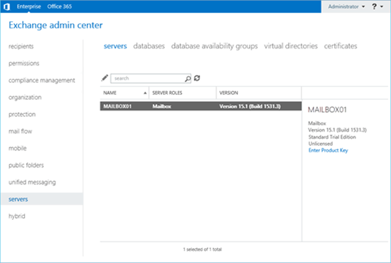
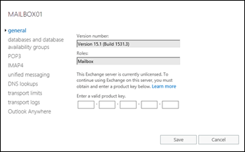
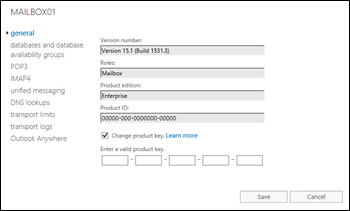
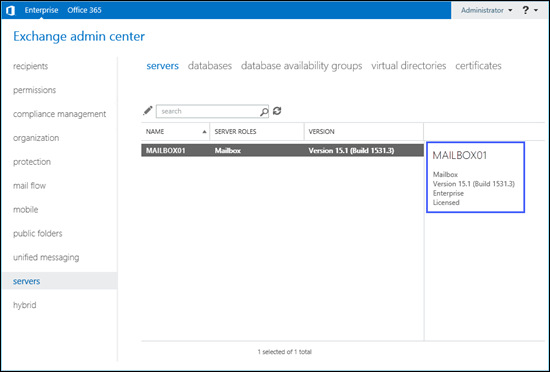

# Enter your Exchange Server product key

A product key tells Exchange Server 2016 or Exchange Server 2019 that you've purchased a Standard or Enterprise Edition license. If the product key you purchased is for an Enterprise Edition license, it lets you mount more than five databases per server in addition to everything that's available with a Standard Edition license. If you want to read more about Exchange licensing, see [Exchange Server editions and versions](../../plan-and-deploy/deployment-ref/editions-and-versions.md).

If you don't enter a product key, your server is automatically licensed as a trial edition. The trial edition functions just like an Exchange Standard Edition server and is helpful if you want to try out Exchange before you buy it, or to run tests in a lab. The only difference is that you can only use an Exchange server licensed as a trial edition for up to 180 days. If you want to keep using the server beyond 180 days, you'll need to enter a product key or the Exchange admin center (EAC) will start to show reminders that you need to enter a product key to license the server.

 **Note**: If you want to install or activate Office, check out:

- [Install Office](https://go.microsoft.com/fwlink/p/?LinkId=403360)

- [Need help with your Office product key?](https://go.microsoft.com/fwlink/p/?LinkId=403361)

If you want to enter a product key on an older version of Exchange, check out [Enter an Exchange 2010 product key](https://go.microsoft.com/fwlink/p/?LinkId=403370).

If you want to enter a product key on an Exchange 2016 or Exchange 2019 server, you're in the right place! Read on.

## What do you need to know before you begin?

- Estimated time to complete this procedure: less than 5 minutes.

- To open the EAC, see [Exchange admin center in Exchange Server](../../architecture/client-access/exchange-admin-center.md). To open the Exchange Management Shell, see [Open the Exchange Management Shell](http://technet.microsoft.com/library/63976059-25f8-4b4f-b597-633e78b803c0.aspx).

- You need to be assigned permissions before you can perform this procedure or procedures. To see what permissions you need, see the "Product key" entry in the [Exchange infrastructure and PowerShell permissions](../../permissions/feature-permissions/infrastructure-permissions.md) topic.

- After you license an Exchange Mailbox server, you need to restart the Microsoft Exchange Information Store service on the server after you enter the product key.

- You can upgrade from a Standard Edition license to an Enterprise Edition license. You can't downgrade from an Enterprise Edition license to a Standard Edition license without reinstalling Exchange.

- For information about keyboard shortcuts that may apply to the procedures in this topic, see [Keyboard shortcuts in the Exchange admin center](../../about-documentation/exchange-admin-center-keyboard-shortcuts.md).

> [!TIP]
> Having problems? Ask for help in the Exchange forums. Visit the forums at: [Exchange Server](https://go.microsoft.com/fwlink/p/?linkId=60612), [Exchange Online](https://go.microsoft.com/fwlink/p/?linkId=267542), or [Exchange Online Protection](https://go.microsoft.com/fwlink/p/?linkId=285351).

## Use the EAC to enter the product key

1. In the EAC. go to **Servers** \> **Servers**, select the server you want to license, and then do either of the following steps:

    - Click **Edit** .

    - In the details pane, click **Enter Product Key**. Note that this link is only available for unlicensed servers.

    

2. The Exchange server properties window opens. On the **General** tab, do one of the following steps:

    - **License an unlicensed server**: Enter the product key in the **Enter a valid product key** text boxes.

      

    - **Change or upgrade the product key on a licensed server**: Select **Change product key** and enter the product key in the **Enter a valid product key** text boxes. Note that you'll only see **Change product key** if the server is already licensed.

      

    When you're finished, click **Save**.

After you license a Mailbox server, do the following steps to restart the Microsoft Exchange Information Store service:

1. On the Exchange server, open the Windows Services console. For example:

  - Run the command `services.msc` from the **Run** dialog, a Command Prompt window, or the Exchange Management Shell.

  - Open Server Manager, and then click **Tools** \> **Services**.

2. In the list of services, right-click on **Microsoft Exchange Information Store**, and then click **Restart**.

## Use the Exchange Management Shell to enter the product key

To enter the product key in the Exchange Management Shell, use this syntax:

```
Set-ExchangeServer <ServerName> -ProductKey <ProductKey>
```
Note that this command works to license an unlicensed server or to upgrade a licensed server from a Standard Edition license to an Enterprise Edition license.

This example licenses the Exchange server named Mailbox01.

```
Set-ExchangeServer Mailbox01 -ProductKey 12345-12345-12345-12345-12345
```

For detailed syntax and parameter information, see [Set-ExchangeServer](http://technet.microsoft.com/library/8e8d3fca-59b3-4355-a637-28bf5e5ca4cf.aspx).

After you license a Mailbox server, run the following command in the Exchange Management Shell to restart the Microsoft Exchange Information Store service:

```
Restart-Service MSExchangeIS
```

## How do you know this worked?

To verify that you've successfully licensed the Exchange server, do any of the following steps:

- In the EAC, go to **Servers** \> **Servers**, and select the server you licensed. In the details pane, verify the Exchange edition value (**Standard** or **Enterprise**) and whether the value **Licensed** is present.

    

- In the Exchange Management Shell, replace _\<ServerName\>_ with the name of the Exchange server you licensed, and run the following command to verify the property values:

    ```
    Get-ExchangeServer <ServerName> | Format-List Name,Edition,*Trial*
    ```

- In the Exchange Management Shell, run the following command to view the licensing status of all Exchange servers in your organization:

    ```
    Get-ExchangeServer | Format-Table -Auto Name,Edition,*Trial*
    ```

