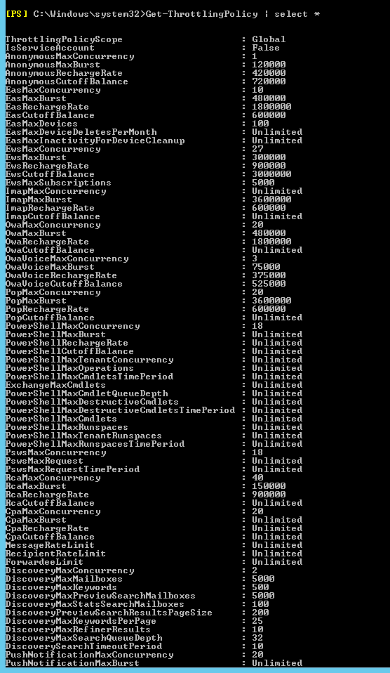

# Change user throttling settings for specific users

_**Applies to:** Exchange Server 2013_

You can control how resources are consumed by individual users in your Exchange organization by changing the default throttling settings.

Controlling how resources are consumed by individual users was possible in Exchange Server 2010, and this capability has been expanded for Exchange Server 2013. The policy named GlobalThrottlingPolicy defines the default throttling settings for every new and existing user in your organization unless you've customized the throttling policies. In many typical Exchange deployment scenarios, the policy named GlobalThrottlingPolicy is adequate to manage users.

To customize throttling settings to apply only to specific users in your organization, create a new throttling policy with the scope assignment Regular. You can only change the default throttling settings by using the Shell.

## What do you need to know before you begin?

- Estimated time to complete: 10 minutes.

- You need to be assigned permissions before you can perform this procedure or procedures. To see what permissions you need, see the "User throttling" entry in the [Server health and performance permissions](server-health-and-performance-permissions-exchange-2013-help.md) topic.

- In new Regular-scope policies, you should set only the throttling settings that are different from those in the policy named GlobalThrottlingPolicy and any other organization policies. This way, the rest of the policy settings from the policy named GlobalThrottlingPolicy will be inherited, as will any updates to throttling policies that are added in future Exchange updates. We recommend that you review the section "Manage throttling policies using scopes" in the topic [Exchange workload management](exchange-workload-management-exchange-2013-help.md) before following this procedure.

- For information about keyboard shortcuts that may apply to the procedures in this topic, see [Keyboard shortcuts in the Exchange admin center](keyboard-shortcuts-in-the-exchange-admin-center-2013-help.md).

> [!TIP]
> Having problems? Ask for help in the Exchange forums. Visit the forums at [Exchange Server](https://go.microsoft.com/fwlink/p/?linkid=60612).

## Use the Shell to change the way resources can be used by specific users in your entire organization

This example creates a non-default user throttling policy named ITStaffPolicy that can be associated with specific users. Any parameters that you omit inherit the values from the default throttling policy GlobalThrottlingPolicy. After you create this policy, you must associate it with specific users.

```powershell
New-ThrottlingPolicy -Name ITStaffPolicy -EwsMaxConcurrency 4 -ThrottlingPolicyScope Regular
```

This example associates a user with the username tonysmith with the throttling policy ITStaffPolicy (which has higher limits).

```powershell
Set-ThrottlingPolicyAssociation -Identity tonysmith -ThrottlingPolicy ITStaffPolicy
```

You don't need to use the **Set-ThrottlingPolicyAssociation** cmdlet to associate a user with a policy. The following commands show another way to associate tonysmith with the throttling policy ITStaffPolicy.

```powershell
$b = Get-ThrottlingPolicy ITStaffPolicy
```

```powershell
Set-Mailbox -Identity tonysmith -ThrottlingPolicy $b
```

For more information about syntax and parameters, see [New-ThrottlingPolicy](https://docs.microsoft.com/powershell/module/exchange/New-ThrottlingPolicy) and [Set-ThrottlingPolicyAssociation](https://docs.microsoft.com/powershell/module/exchange/Set-ThrottlingPolicyAssociation).

## How do you know this worked?

To verify that you've successfully created the Regular throttling policy, do the following:

1. Run the following command.

   ```powershell
   Get-ThrottlingPolicy | Format-List
   ```

2. Verify that the Regular throttling policy you just created is listed in the column that shows the GlobalThrottlingPolicy object.

3. Run the following command.

   ```powershell
   Get-ThrottlingPolicy | select *
   ```

   

4. Verify that the properties for the new Regular policy match the value or values you configured.

5. Run the following command.

   ```powershell
   Get-ThrottlingPolicyAssociation
   ```

6. Verify that the new Regular policy is associated with the user or users you associated it with.
