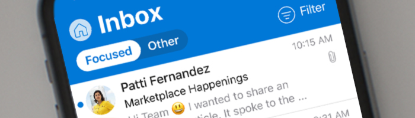

# Plan, deliver, and adopt Outlook for iOS and Android in your organization

Outlook mobile brings the best of Office 365 – your email, calendar, documents, online meetings and more – in one place, right at your fingertips. It combines a fast, fluid experience with enterprise grade security so you accomplish the most important tasks in just a few seconds.

Join the over 100 million customers across the world who trust Outlook mobile to stay connected, organized and get things done on the go.

The following is content and guidance that IT administrators, trainers, champions, and change management professionals can use to drive Outlook mobile adoption in your organization and help ensure your users get up and running quickly.

## Deploy Outlook mobile with Microsoft 365 Security, Compliance, and Identity and get the Total Economic Impact

Deploy Outlook for iOS and Android and Microsoft 365 Security, Compliance, and Identity solutions with the latest in encryption, sensitivity labeling, end point management and app protection policies. Get peace of mind by helping protect your company against external threats with built-in privacy and compliance capabilities.

### Microsoft 365 Security, Compliance, and Identity with Outlook mobile

[Learn more in this article](media/outlook-mobile-security-for-enterprise.pdf) that explains how you can control access, protect data, and help prevent accidental leaks of your company information through email and calendaring.

### TEI study shows Outlook mobile cost savings

Microsoft commissioned Forrester&reg; to do study about the cost of deploying Outlook for iOS and Android in enterprises. The [Forrester Total Economic Impact&trade; (TEI)](media/forrester-tei-infographic.pdf) provides an analysis of the cost savings and business benefits of Outlook mobile as described by four large enterprise companies.  

## Outlook mobile Customer Adoption Pack

Use the resources in the [Outlook mobile Customer Adoption Pack](https://aka.ms/OutlookmobileCAP) to make the most of Microsoft Outlook for iOS and Android for your organization. This adoption pack contains a wide range of customizable onboarding templates, flyers, and posters, that IT Pros, administrators, and trainers can use to roll out and drive the adoption of Outlook mobile to end users in their organization.
 
You can view resources for each phase of rollout below or download customer adoption resources from this [Customer Adoption Pack .zip file](https://aka.ms/OutlookmobileCAP). 

## Pre-launch

In this first phase, we focus on internal awareness and communication or engagement events that create excitement and awareness for end users.

- [Flyer template](media/outlook-mobile-editable-flyer.docx) - Customizable flyer handout for your employees.
- [Poster template](https://github.com/MicrosoftDocs/OfficeDocs-Exchange/raw/public/Outlook/mobile/media/outlook-mobile-editable-poster.pptx) - Customizable poster used to help raise awareness of your Outlook mobile rollout.
- [Countdown email template](media/outlook-mobile-countdown-email.zip) - Customizable email informing employees of upcoming Outlook mobile rollout within your organization.

## Launch Day

This is the broad scale deployment phase. Communication and guides are available to help end users get set up quickly and easily.

- [Rollout announcement email template](media/outlook-mobile-rollout-announcement-email.zip) – Customizable email informing employees of your Outlook mobile roll-out.
- How to install Outlook for [iOS](https://support.office.com/article/b2de2161-cc1d-49ef-9ef9-81acd1c8e234) and [Android](https://support.office.com/article/886db551-8dfa-4fd5-b835-f8e532091872) - Article with instructions to help employees install Outlook mobile on their devices.
- Quick reference cheat sheets for Outlook for [iOS](https://aka.ms/iOSCheatSheet) and [Android](https://aka.ms/AndroidCheatSheet) - PDF handout to get your employees familiar with Outlook mobile and get them started quickly.
- [Optimize the Outlook mobile app](https://aka.ms/OMoptimize) - Article providing employees with tips on how to optimize Outlook for their needs.

## Post-launch

During the post-launch phase, focus is placed on providing time saving tips to support employees as they start using Outlook mobile on a day-to-day basis.

### Content and templates

- [Outlook mobile tips email template](media/outlook-mobile-tips-email.zip) – Customizable email to send to employees post-launch with tips to stay more productive on the go.
- [Outlook for iOS and Android: time saving tips reference sheet](media/outlook-mobile-time-saving-tips.pdf) - PDF that provides time saving tips of Outlook mobile features and functionality.

### Training

- [End user training videos](https://aka.ms/Omvideos) - Short videos to play during the launch events to create excitement and awareness.
- *On Demand Webinar: 10 time saving tips* ([watch now](https://aka.ms/JoinOutlookmobile)) - Invite your employees to watch webinar training, hosted by Microsoft, showcasing time saving tips on Outlook mobile. These 60-minute webinars are delivered by Outlook mobile experts from Microsoft and are designed to get your employees up and running and learn cool tips that save them time.

  In this webinar series, you'll learn the following:
  - Why Outlook mobile is the right choice for you
  - Cool tips to help you accomplish the most important tasks in just a few seconds

  These demo webinars focus on end user value so invite your business decision makers, end users, trainers, change management personnel, champions, and more!
